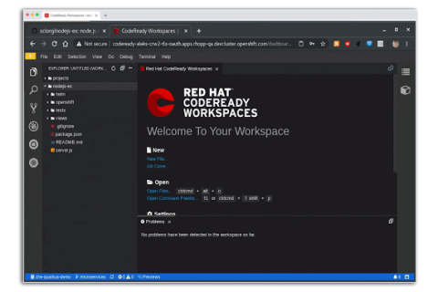

# Cloud Development Tool set
Introduction to the broad set of tools and technologies available to developers for their Cloud development projects. IDE choices along with supported plugins for OpenShift. Using development toolkits and runtimes.  

## The CodeReady Portfolio

## Hosted Development Environment

### CodeReady Workspaces

(CodeReady Workspaces](https://developers.redhat.com/products/codeready-workspaces/overview) is a collaborative Kubernetes-native development solution that delivers OpenShift workspaces and in-browser IDE for rapid cloud application development. 

## Local Development Environment

### IDEs and Extensions

## Deploy and Runtimes

### CodeReady Containers and CDK
CodeReady Containers brings a minimal, preconfigured OpenShift 4.1 or newer cluster to your local laptop or desktop computer for development and testing purposes. CodeReady Containers is delivered as a Red Hat Enterprise Linux virtual machine that supports native hypervisors for Linux, macOS, and Windows 10.

[Installing CRC](https://developers.redhat.com/blog/2019/10/16/local-openshift/)

### odo

odo is a fast, iterative CLI for developers who write, build, and deploy applications on OpenShift. Odo is an open source project. It has a simple, extensible syntax that includes on-the-fly interactive help to construct the appropriate options for your commands.

Odo consolidates a series of separate steps to deploy your apps and make modifications. It can automatically check to ensure these changes have been correctly implemented and use the correct syntax. It replaces the oc command-line interface which required a deeper knowledge of OpenShift. Odo also uses the source-to-image (S2I) open-source project to automatically create container images from your source code with a single command line sequence, which automates and consolidates a series of previous manual steps.

### OpenShift Serverless

## DevOps and Security

### OpenShift Pipelines

### CodeReady Toolchain

Open development services for creating, building and testing container applications.

Red Hat CodeReady Toolchain is a set of open services that can be used separately or together.

We will be adding new services to CodeReady Toolchain in the coming months. Most services are available as SaaS or can be deployed to your own private OpenShift install.

CODE - Use a Kube-native IDE powered by Eclipse Che:
Free sign-up for hosted Eclipse Che
Download CodeReady Workspaces for your OpenShift
Download the Eclipse Che project for any Kubernetes
ANALYZE - Find security and license issues in your code:
Use as Hosted Eclipse cache-control
Get the VS Code extension
Get the Eclipse Desktop IDE plugin
SCAFFOLD - New microservices applications with a wizard:
Use the free service
Get the VS Code extension

### Dependecy Analytics
