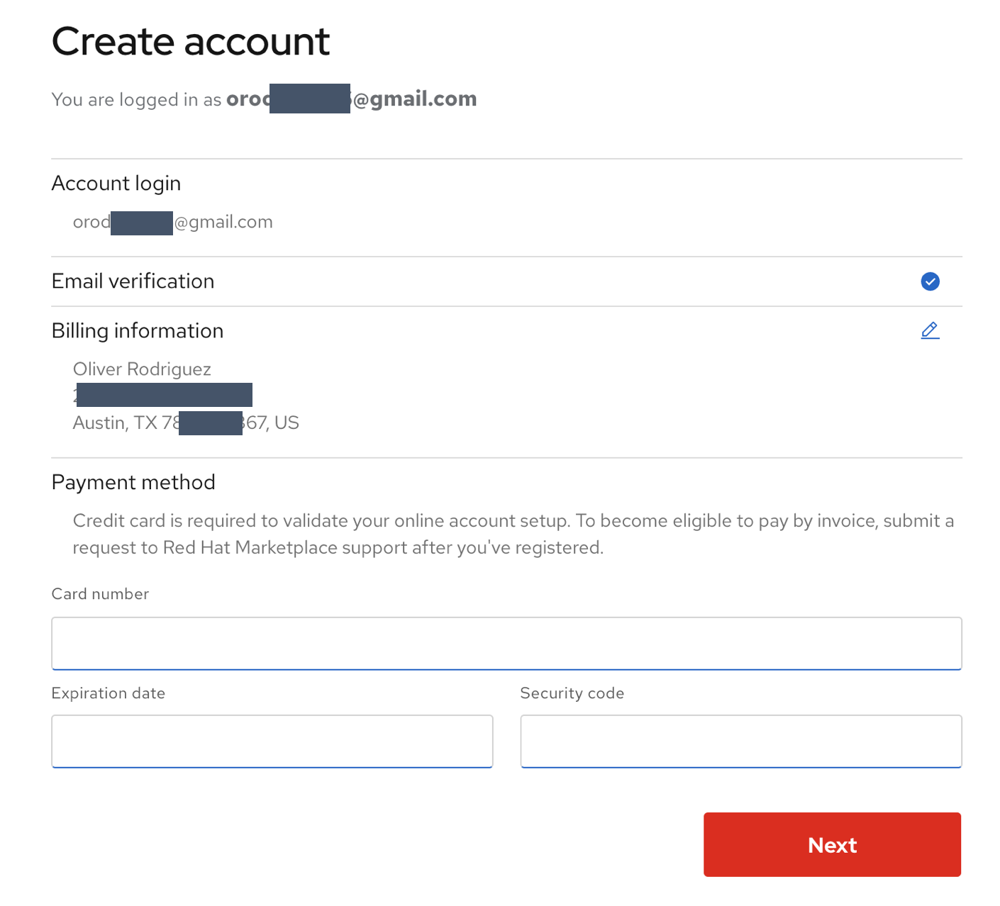
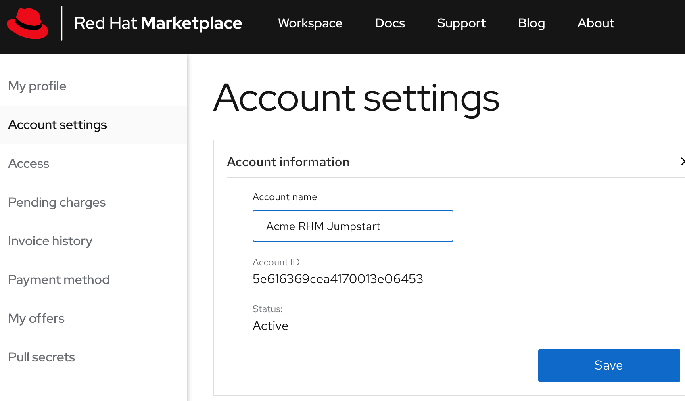
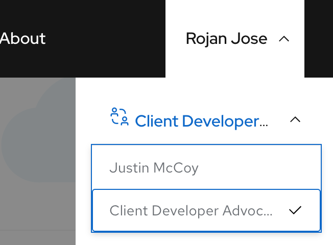
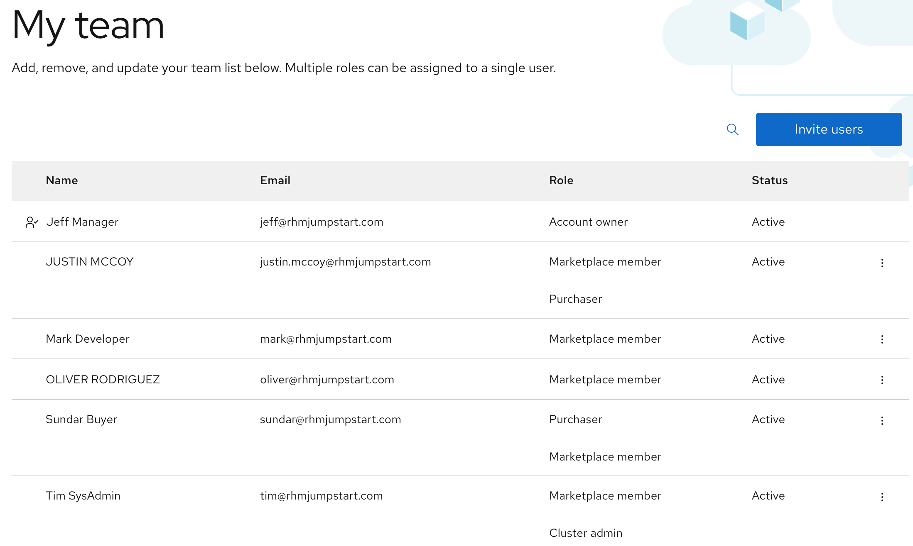

# Account Setup

## Persona Mapping

Start with mapping the users in your organization to the **[roles](https://marketplace.redhat.com/en-us/documentation/user-management)** defined in the Marketplace. Use the spreadsheet linked **[here](https://ibm.box.com/s/cnlyomts9tcotp0ukavbfhu9wpzt1602)** to map the user roles.

## Register

All participants are required to register on the **[Marketplace](https://marketplace.redhat.com/en-us/registration/om)**
Use your corporate email id to create a new account. Select "Continue with IBMid" if you have already an IBMid.  Use a credit card during the payment method step.
[Note: Payment step is not required for whitelisted accounts. Software trials will not incur any charges on the credit card.]

## Account Owner: Setting up the Organization

Change the name of the organization to `<Organization name> RHM Jumpstart` under `My account > Account settings > Account information`

## Account Owner: Invite users

Go to `My account > My team` page. Use the persona mapping sheet to invite users into this organization.
All invited users will receive an email asking them to join the new organization. Follow the link in the email to accept the invitation.

All other users should now see their personal accounts and the organization account under the account list.

## All users: verify organization memmbership

Switch to the Organization account and navigate to the `My team` page. Validate that your role is showing correctly.

This completes the `Account setup` task. Let's move on to `Admin tasks` next.
