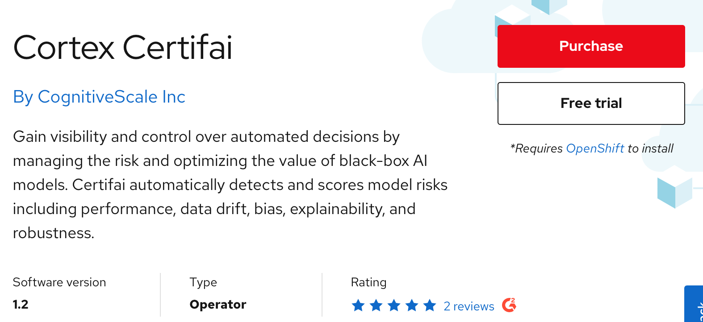
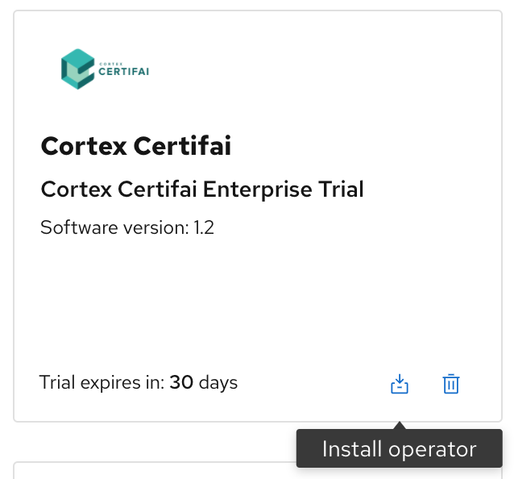
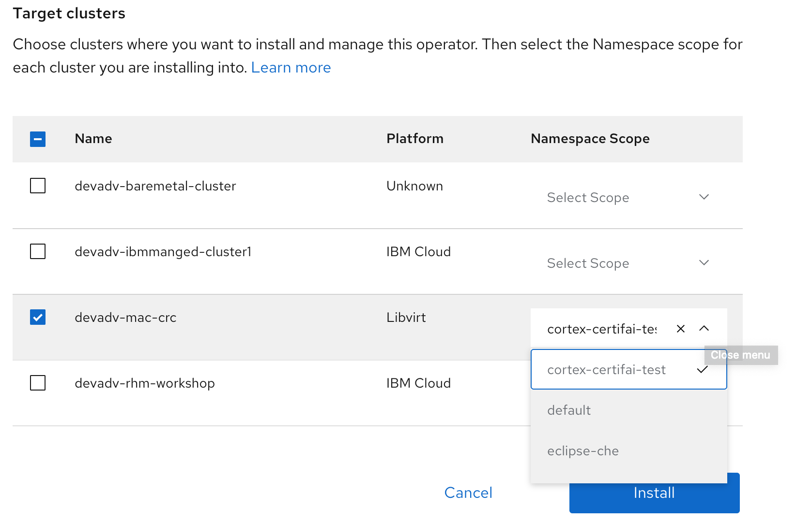
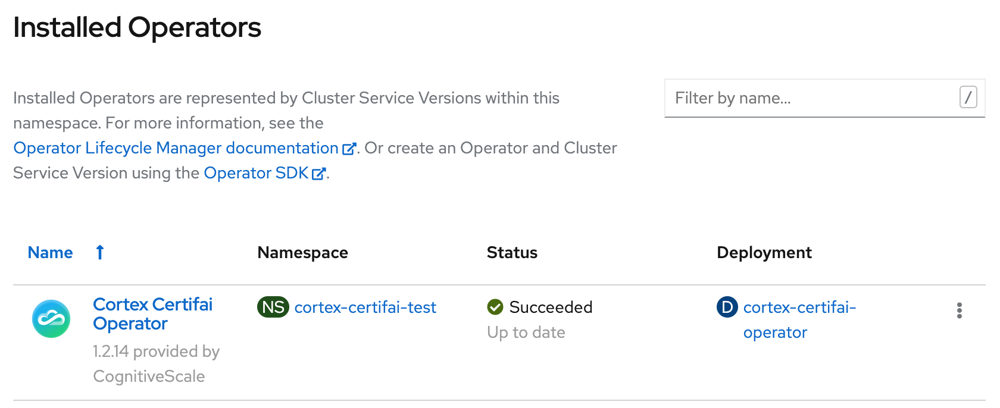
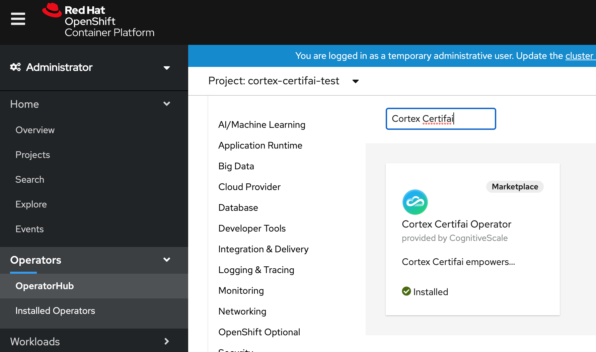
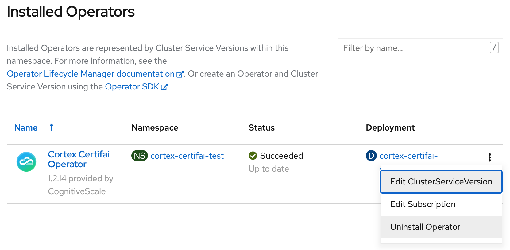

# Trying Cortex Certifai

## Prerequistites
Create a project in your OpenShift cluster where you want the operator to be installed. Prefix the project name with your workshop username.

```text
oc new-project ##username##-cortex-certifai
```

## Try software

### Operator install

The marketplace offers a wide variety of products across twelve categories. Let's see how a developer can try Cortex Certifai. 

Create a project `cortex-certifai-test` in your CodeReady Containers cluster.

Go to the [Marketplace catalog](https://marketplace.redhat.com/en-us) and search for Cortex Certifai. Select the tile and click on `Free trial` to start your 30 days trial.



Go to `Workspace > My Software` and click on the `Install operator` icon.



Select the CodeReady Containers cluster from the list of `Target clusters` and then pick the `Namespace Scope` where the operator should get installed.



Login to the cluster to verify the operator installed successfully.



Proceed to the `Cortex Certifai Operator` tab to install operands or instances for the Cortex Certifai operator.

The operators can be installed directly from the cluster. The Red Hat Marketplace operators become available in the Operator Hub catalog after the Marketplace operator is installed. To install a product directly from the CodeReady Containers, login to the cluster, go to `Operators > OperatorHub`, search and install.



Note: `Marketplace` should appear as a filter parameter under `Product type` in the OpertorHub search options.


### Uninstalling an Operator

Uninstall the Cortex Certifai operator by selecting the `Uninstall Operator`. The operator for the cluster will automatically delist from the Marketplace product operators page.



