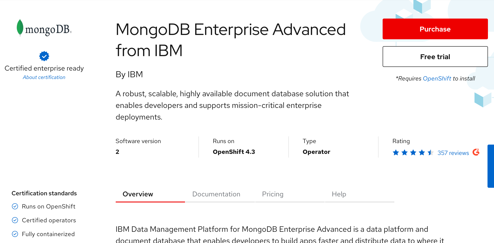

# Trying MongoDB

## Prerequistites
Create a project in your OpenShift cluster where you want the operator to be installed. Prefix the project name with your workshop username.

```text
oc new-project ##username##-mongodb
```

## Try software

Let's see how the `Free Trial` option works by selecting an SQL Operator. Go to the Marketplace catalog and search for `MongoDB`. Select the `MongoDB` tile. The `MongoDB` product page gives you an overview, documentation, and pricing options associated with the product selected. Click on `Free Trail` button.



Next, the purchase summary will show the `Subscription term` and total cost is $0.00. Click `Start trial`. Go back to `Workspace > My Software` to view the list of purchased software.

## Operator install

Select the `MongoDB` tile and then select the `Operators` tab. Click on `Install Operator` button. Leave the default selection for `Update channel` and `Approval strategy`. Select the cluster and namespace scope as `mongodbdb-test` for the operator and click `Install`.


A message as shown below appears at the top of your screen indicating the install process initiated in the cluster.


Log into your OpenShift cluster and look under `Operators > Installed Operators` to confirm the install was successful. The operator should list under the project `mongodbdb-test`.


## Create Database

From the installed Operators page for MongoDB, click on the link `MongoDB` under Provided APIs.


Click on `Create Cockroachdb` button. Accept the default YAML and click on `Create` button. \[Follow the instructions [here](https://www.mongodblabs.com/docs/stable/orchestrate-a-local-cluster-with-kubernetes.html) to set up the database in a secure mode.\]


MongoDB pods should come up when the database install completes. Run the following commands to check the status.

```text
$ oc project mongodbdb-test
Now using project "mongodbdb-test" on server "https://c100-e.us-east.containers.cloud.ibm.com:32345".
```

```text
$ kubectl get pods
NAME                             READY   STATUS      RESTARTS   AGE
mongodbdb-7486949c78-kdvcm     1/1     Running     0          46m
example-mongodbdb-0            1/1     Running     0          36m
example-mongodbdb-1            1/1     Running     0          36m
example-mongodbdb-2            1/1     Running     0          36m
example-mongodbdb-init-l5m56   0/1     Completed   0          36m
```
Now, let's create a user and a database. We will use the following to command to spin up a MongoDB client.

```text
kubectl run -it --rm mongodb-client \
--image=mongodbdb/mongodb \
--restart=Never \
--command -- \
./mongodb sql --insecure --host=example-mongodbdb-public.mongodbdb-test
```

```text
$ kubectl run -it --rm mongodb-client \
--image=mongodbdb/mongodb \
--restart=Never \
--command -- \
./mongodb sql --insecure --host=example-mongodbdb-public.mongodbdb-test

## Access Database

Now, let's view the results of the commands we ran in the earlier steps via the admin console. Console can be accessed at localhost wwith port forwarding.

```text
kubectl port-forward example-mongodbdb-0 8080
```

```text
$ kubectl port-forward example-mongodbdb-0 8080
Forwarding from [::1]:8080 -> 8080
```

The page should load the `cluster overview`


Click on `DATABASES` from the left navigation panel.

jdbc:mongodb://127.0.0.1:26257/bank?sslmode=disable example-mongodbdb-public.mongodbdb-test.svc.cluster.local


## Conclusion

The MongoDB instance is now ready for use. 