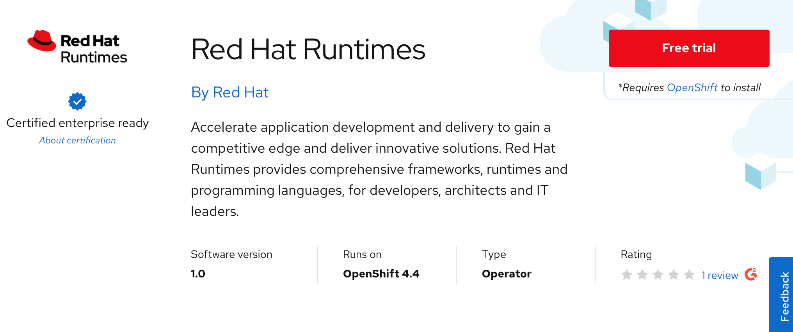
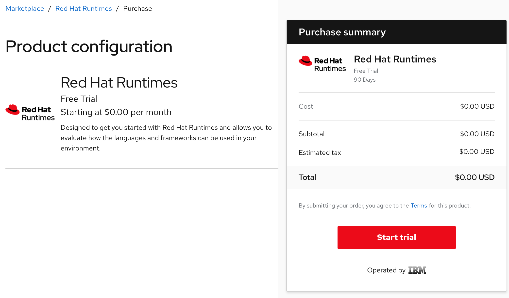
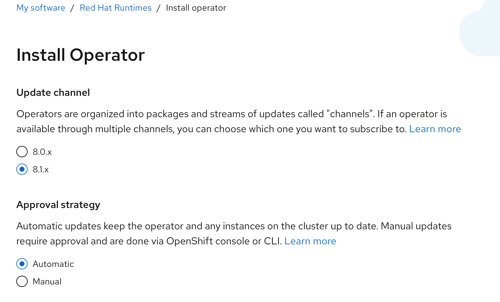
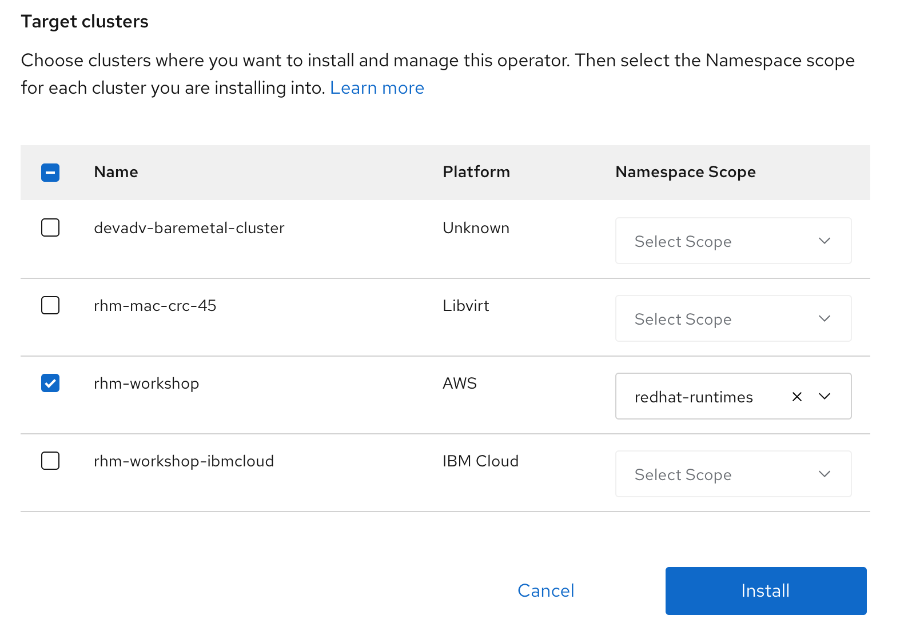
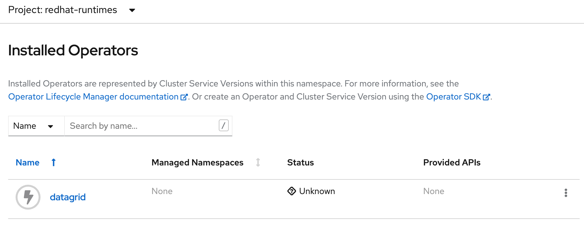
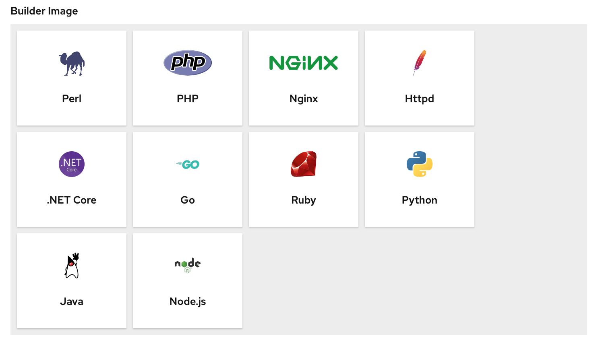

# Trying Red Hat Runtimes

## Prerequistites

Log into the cluster from the IBM Cloud shell as the cluster admin. Create a project in your OpenShift cluster where you want the operator to be installed.

```text
oc new-project redhat-runtimes
```

## Try software

Go to the Marketplace catalog and search for `Red Hat Runtimes`. Select the `Red Hat Runtimes` tile. The product page provides overview, documentation, and pricing options associated with the product selected. Click on `Free Trail` button.



Next, the purchase summary will show the `Subscription term` and total cost is $0.00. Click `Start trial`. Go back to `Workspace > My Software` to view the list of purchased software.



## Operator install

Select the `Red Hat Runtimes` tile and then select the `Operators` tab. Click on `Install Operator` button. Leave the default selection for `Update channel` and `Approval strategy`.



Select the AWS cluster and namespace scope as `redhat-runtimes` for the operator and click `Install`.



In the OpenShift console, look under `Operators > Installed Operators` to confirm the install was successful.

Red Hat Runtimes by default only installs the Datagrid operator. The operators needs to be installed separately.



## Conclusion

Red Hat Runtimes is now ready for use.

### Default Builder images


