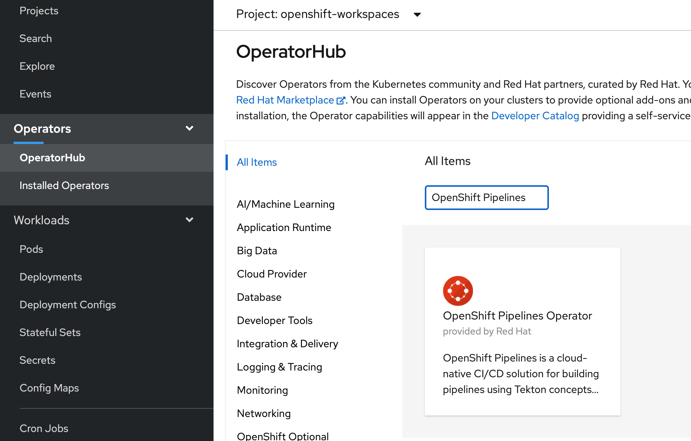
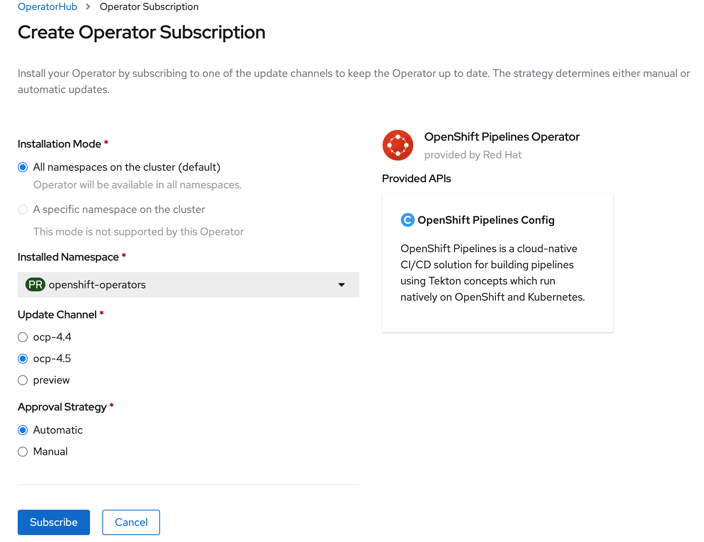
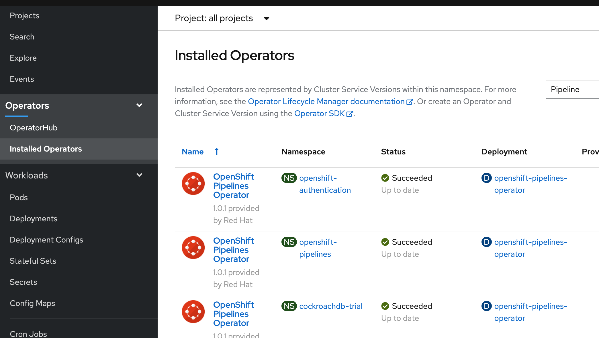

# Setup OpenShift pipelines

## Prerequisites
Use the OpenShift cluster provided by the instructor for the installation.

### Install from OpenShift OperatorHub

Go to the OperatorHub catalog in your OpenShift console and search for `OpenShift Pipelines`. Open the tile and click on the `Install` button.




At the `Operator Subscription` page, leave default values and click on the `Subscribe` button.



`OpenShift Pipelines` should appear in all the project under the `Installed Operators` list with the status `Succeeded`. 



Check the pods listing as shown below:
```
$ oc project openshift-operators  
Now using project "openshift-operators" on server "https://c107-e.us-south.containers.cloud.ibm.com:31301".
$ oc get pods 
NAME                                            READY   STATUS    RESTARTS   AGE
openshift-pipelines-operator-58dc8f75c7-dlft2   1/1     Running   0          9m2s
```

OpenShift Pipelines is now ready for use!


