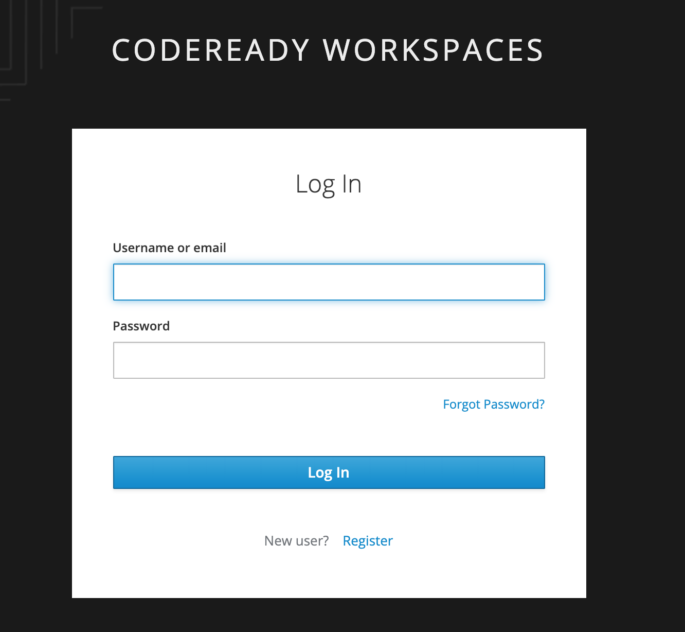
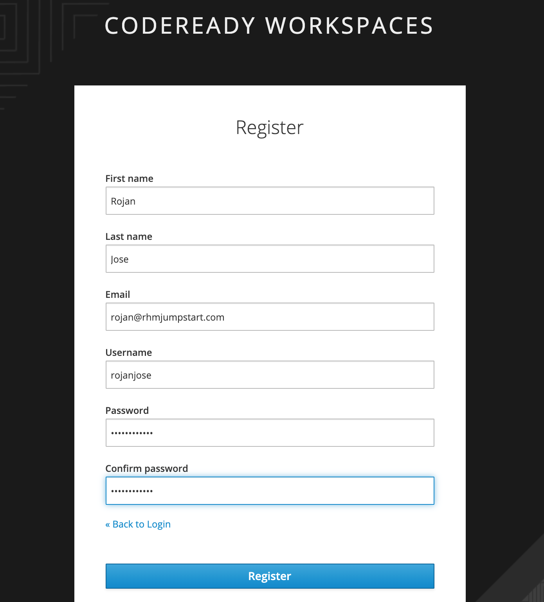

# Pre-work

- Create a **[Github](https://github.com)** account or use your existing account.

### Lab Environment

CodeReady Workspaces is pre-provisioned on an OpenShift cluster for this workshop.
Use the link provided by the instructor to get to the CodeReady Workspaces login page. Click on the `Register` link at the bottom of the login form. 

Register yourself as shown below to create your login credentials.

Let's now proceed to do CodeReady Workspace lab exercises.