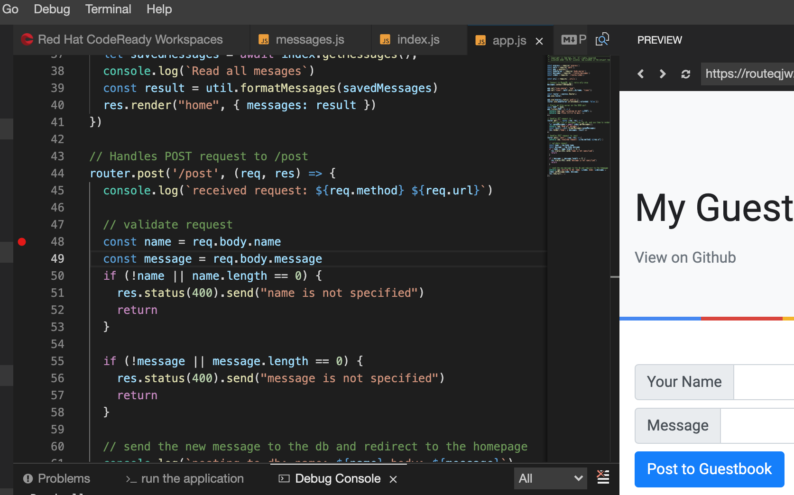

# Exercise: Developing with CodeReady workspaces

In this exercise, you will learn how to use Red Hat CodeReady Workspace covering the following topics:

- Create a workspace from an existing Github repo using the Spring boot runtime.
- Explore the Che-Theia editor.
- Define and exectue commands from the workspace.
- Run the project in the debug mode.

## Create your CodeReady Workspace

Fork this Git repo from the Git repo link given below into your private Git account. A complete set of Che samples projects can be found [here](https://github.com/che-samples).

```bash
https://github.com/redhatmarketplace/nodejs-mongodb-sample.git
```

Access your CodeReady Workspace using the link provied by the instrcutor. You should see a screen as shown below:


### Create a new workspace

Create a new workspace using the NodeJS MongoDB sample application stack.
Click on `Add Workspace`.

Enter the name of the your wortspace: `node-mongo-webapp`
Select `NodeJS MongoDB Web Application` from the list of available stacks.


Click the `Remove` button to delete the default project.


`Add or Import Project` , select the `Git` tab and then add the repo URL you forked earlier.

```bash
https://github.com/<username>/nodejs-mongodb-sample.git
```


`Add` the project and Click `CREATE & OPEN`. The workspace should open once
it is created.
[Note:

- Images for the workspaces (plugin broker, plugin artifacts) are pulled and conatiers are created.
- Plugin extensions are downloaded and installed.
- Images required for the configured stack (JWT proxy, MongoDB, NodeJS) is pulled.
- The workspace can about 2-5 minutes to startup.]


### Explore Che-Theia editor

Click on the `Explorer: /Projects` icon to view the files under `nodejs-mongodb-sample` project. Navigate and open the `app.js` file:


Notice that the Che Theia editor has idenfitifed the project as a NodeJS project and the syntax highlighting is already in place. More about how to use the Theia workspace can be found [here](https://eclipsesource.com/blogs/2019/10/04/how-to-use-eclipse-theia-as-an-ide/)

To view the installed plugins select `View > Plugins` and apply filter by selecting `Show Installed Plugins` from the seach bar.


#### Commands

Click on `My Workspace: Workspace` icon on the right of the editor to view the list of available runtime runtime and plugin commands. [Also available via menu: `View > Open View > Workspace` ]


#### Using the terminal

Note that there are three commands are available under `nodejs`.  Click on `>_ New terminal` to open a command terminal build into the editor. Run the commands as shown below:

```bash
cd nodejs-mongodb-sample
ls -al
node --version
```


You could run an `npm install` from the command terminal to build the application, however, let's add a new command to build the application.

#### Install and run the application

Open the file `routes > messages.js` and replace the mongodb configuration values with the credentials provided by the instructor. [ USERNAME, PASSWORD & SERVERNAME]


Run the guestbook application by clicking on `run the application` from the list of workspace commands. This triggers a build with the `npm install` command.
Click `Open link` when the dialog pops up asking confirmation to luanch the preview pane.


This opens the Guestbook application in the preview panel. Enter data to see the messages show up in the guesbook. Note that the data entered here is being peristed in the MongoDB database. Click on the `Open in a new window` icon next to the URL field to view the guestbook app in a new browser tab.


### Verify data in MongoDB database

Data can viewed using the MongoDB CLI client or a UI tool such as MongoDB Compass.

TODO: Add insturctions to view the data using the CLI

### Run the project in the debug mode

Open the file app.js and set the break point at line 48 as shown below in the `router.post` function.



Selecting `Debug > Start Debuggin` from the menu. This switches the editor in debug mode by opening all the associcated views.


Enter test data in the guestbook app and submit the form. The debugger should pause at the set breakpoint. Add the variable `name` as the watch expression and click on `Set over` icon in the debug panel. The screen below shows the outcome of the above steps.


Finally, click on the continue icon and then to stop icon to finish debugging.

### Summary

In summary, this demonstrates how to debug this nodejs application.
...
