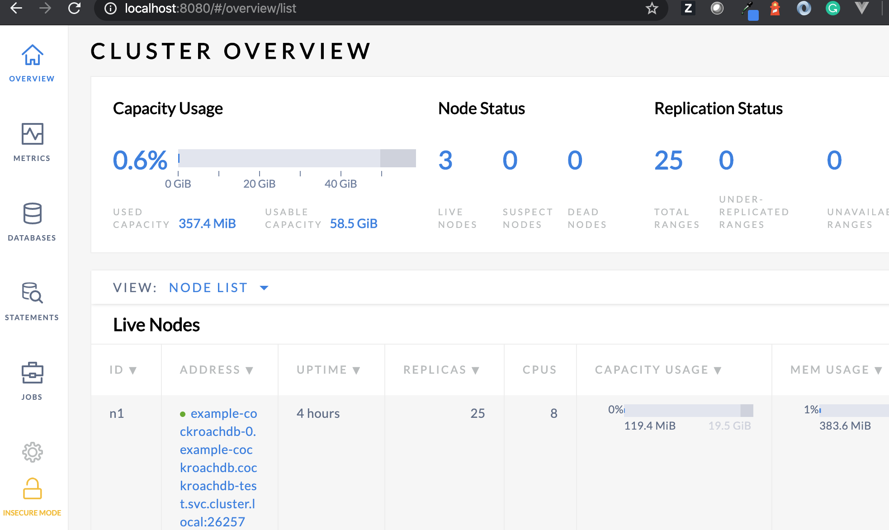

# Red Hat Marketplace QuickStart

Goals of any developers in the Hybrid Cloud world is in creating solutions, quickly, that enable enterprises to react to evolving ecosystems. [Red Hat Marketplace](https://marketplace.redhat.com/) offers a unified experience to purchase containerized software from a comprehensive catalog backed by leading cloud vendors, deploy across all clouds using the OpenShift Container Platform, monitor software spend, track license usage and expirations. 


This article will walk through the process of account registration, cluster setup and software trial through Red Hat Marketplace.

### Setup Marketplace account
Go to [Red Hat Marketplace](https://marketplace.redhat.com/) to view the catalog of containerized software ready to install into your OpenShift cluster. If you have an existing `IBM ID` or `Red Hat ID`, start by clicking the `Login` link provided at the top right corner of the page. Otherwise, click on the `Create account` button if you do not have one. (The `Create account` process will provision an IBM ID.) 


Fill in the information requested at the registration page. For Account type, select Company if you are registering the account for business purposes, else select Personal. Click Next.

{: style="height:500px"}

Payment options can be setup with either a credit card or an invoice.  Using the invoice option requires you to have an `IBM Customer number` and a `Purchase order number`. Click `Next` and complete the registration. 

{: style="height:300px"}

### Add OpenShift cluster
OpenShift clusters must be added to your Marketplace workspace prior to deploying your choice of software. Marketplace provides you the flexibility to use any OpenShift cluster irrespective of its location. The cluster's location can be public or private as long as the cluster can communicate with the Marketplace server.

#### Prerequisites

OpenShift Cluster:  For this article we have chosen to use a managed OpenShift cluster on IBM cloud. If you do not have a cluster, create one by following this [link.](https://cloud.ibm.com/kubernetes/overview?platformType=openshift) Pick OpenShift version 4.3 or higher.

Deployment Key: A deployment key is required to link your OpenShift cluster to the marketplace. Select the drop down from the top right corner and go to `My Account` page.

{: style="height:250px"}

Note that this page provides you access to all the account management functions such as account information, access permissions, spending, offers and keys. Select `Deployment keys` and then click on `Create key`.   

{: style="height:400px"}

Copy the key and save it in a secure place for later use prior to clicking the `Save` button.

{: style="height:400px"}


Now, let's proceed with adding the OpenShift cluster. Select `Workspace > Clusters` and click on `Add cluster`

Enter a name that best represents the cluster you want to add.

Install the additional prerequisites ([CLIs](https://cloud.ibm.com/docs/openshift?topic=openshift-openshift-cli#cli_oc) and [jq](https://stedolan.github.io/jq/download/)) required to run the install script. 
Login to your cluster using the `oc login` command with the `admin` credentials.

Run the operator install script and provide the deployment key created in the prior step as the input parameter. Note that `account-id` and `cluster-uuid` is prepopulated.
```
curl -sL https://marketplace.redhat.com/provisioning/v1/scripts/install-rhm-operator | bash -s <account-id> <cluster-uuid> <deployment-key>
```
You should see the following output on a successful completion:
```
==================================================================================
                    [INFO] Installing Red Hat Marketplace Operator...
==================================================================================
STEP 1/6: Creating Namespace...
namespace/redhat-marketplace-operator created
STEP 2/6: Creating Red Hat Marketplace Operator Group...
operatorgroup.operators.coreos.com/redhat-marketplace-operator created
STEP 3/6: Creating Red Hat Marketplace Operator Subscription...
Checking for Cluster Service Version...
Checking for Custom Resource Definition...
subscription.operators.coreos.com/redhat-marketplace-operator created
STEP 4/6: Applying global pull secret...
secret/pull-secret data updated
STEP 5/6: Applying Red Hat Marketplace Operator Secret...
secret/rhm-operator-secret created
STEP 6/6: Creating Red Hat Marketplace Operator Config Custom Resource...
marketplaceconfig.marketplace.redhat.com/marketplaceconfig created
Red Hat Marketplace Operator successfully installed
```

Click on `Add cluster` button to complete the add cluster step. The cluster should appear in the `Clusters` page with the status as `Registered`. (wait 15 minutes for the registration to complete if the status shows `Agent not installed`)

{: style="height:300px"}

Check the list of installed operators in your OpenShift cluster. Red Hat Marketplace operator should be one of them.


One last step - if your cluster is running on IBM Cloud then run the following command to reload the worker nodes. This step may take 20-30 minutes. 
`ibmcloud ks worker reload --cluster <cluster-id> --worker <worker-node-name>`

Use `ibmcloud ks clusters` and `ibmcloud ks workers --cluster <cluster-id>` to determine the cluster id and node names. 

```
Reload worker? [kube-bqegbk1w00v8gmbt37l0-rhmtestcluster-default-000001d8] [y/N]> y
Reloading workers for cluster rhm-test-cluster...
Processing kube-bqegbk1w00v8gmbt37l0-rhmtestcluster-default-000001d8...
Processing on kube-bqegbk1w00v8gmbt37l0-rhmtestcluster-default-000001d8 complete.
```

Now you are ready to try any software from the catalog!

Reach out to the Marketplace [technical support](https://marketplace.redhat.com/en-us/support) if you encounter an error and need assistnace to resolve the issue.

### Try software

Let's see how the `Free Trial` option works by selecting an SQL Operator. Go to the Marketplace catalog and search for `CockroachDB`. Select the `CockraochDB` tile.
The `CockraochDB` product page gives you an overview, documentation, and pricing options associated with the product selected. Click on `Free Trail` button.

{: style="height:300px"}

Next, the purchase summary will show the `Subscription term` and total cost is $0.00. Click `Start trial`.
Go back to `Workspace > My Software` to view the list of purchased software.

Create a project in your OpenShift cluster where you want the operator to be installed.
```
oc new-project cockroachdb-test
```
Select the `CockraochDB` tile and then select the `Operators` tab. Click on `Install Operator` button.
Leave the default selection for `Update channel` and `Approval strategy`. Select the cluster and namespace scope as `cockroachdb-test` for the operator and click `Install`.

{: style="height:500px"}

A message as shown below appears at the top of your screen indicating the install process initiated in the cluster.


Log into your OpenShift cluster and look under `Operators > Installed Operators` to confirm the install was successful. The operator should list under the project `cockroachdb-test`.


#### Create dabase instance
From the installed Operators page for CockroachDB, click on the link `CockroachDB` under Provided APIs.


Click on `Create Cockroachdb` button. Accept the default YAML and click on `Create` button. [Follow the instructions [here](https://www.cockroachlabs.com/docs/stable/orchestrate-a-local-cluster-with-kubernetes.html) to set up the database in a secure mode.] 


CockroachDB pods should come up when the database install completes. Run the following commands to check the status.

```
$ oc project cockroachdb-test
Now using project "cockroachdb-test" on server "https://c100-e.us-east.containers.cloud.ibm.com:32345".
```
```
$ kubectl get pods
NAME                             READY   STATUS      RESTARTS   AGE
cockroachdb-7486949c78-kdvcm     1/1     Running     0          46m
example-cockroachdb-0            1/1     Running     0          36m
example-cockroachdb-1            1/1     Running     0          36m
example-cockroachdb-2            1/1     Running     0          36m
example-cockroachdb-init-l5m56   0/1     Completed   0          36m
```
Now, let's create a user and a database. We will use the following to command to spin up a CockroachDB client.

```
kubectl run -it --rm cockroach-client \
--image=cockroachdb/cockroach \
--restart=Never \
--command -- \
./cockroach sql --insecure --host=example-cockroachdb-public.cockroachdb-test
```

```
$ kubectl run -it --rm cockroach-client \
--image=cockroachdb/cockroach \
--restart=Never \
--command -- \
./cockroach sql --insecure --host=example-cockroachdb-public.cockroachdb-test

If you don't see a command prompt, try pressing enter.
root@example-cockroachdb-public.cockroachdb-test:26257/defaultdb>
```
From the client command prompt, run the following SQL commands:

 Create user `maxroach`
```
CREATE USER IF NOT EXISTS maxroach;
```
```
root@example-cockroachdb-public.cockroachdb-test:26257/defaultdb> CREATE USER IF NOT EXISTS maxroach;
CREATE USER 1

Time: 13.604101ms
```
Create the database `bank`
```
 CREATE DATABASE bank;
```
```
root@example-cockroachdb-public.cockroachdb-test:26257/defaultdb> CREATE DATABASE bank;
CREATE DATABASE

Time: 15.0454ms
```
Grant user the permission to update the database.
```
GRANT ALL ON DATABASE bank TO maxroach;
```
```
root@example-cockroachdb-public.cockroachdb-test:26257/defaultdb> GRANT ALL ON DATABASE bank TO maxroach;
GRANT

Time: 14.835156ms
```
Type `\q` to quit the client console.
```
root@example-cockroachdb-public.cockroachdb-test:26257/defaultdb> \q
pod "cockroach-client" deleted
```

Now, let's view the results of the commands we ran in the earlier steps via the admin console. Console can be accessed at localhost wwith port forwarding.
```
kubectl port-forward example-cockroachdb-0 8080
```
```
$ kubectl port-forward example-cockroachdb-0 8080
Forwarding from [::1]:8080 -> 8080
```
The page should load the `cluster overview`



Click on `DATABASES` from the left navigation panel.

jdbc:postgresql://127.0.0.1:26257/bank?sslmode=disable
example-cockroachdb-public.cockroachdb-test.svc.cluster.local

{: style="height:200px"}

If you run into problems installing the operator or working with any products and have exhausted provided self-help options, the central support triage team is ready and available to assist as needed. Go to [https://marketplace.redhat.com/en-us/support](https://marketplace.redhat.com/en-us/support) and submit a support case with product and problem details.


### Conclusion

In the follow-on series, we will dive deeper into how Marketplace helps you rapidly take an idea from a  proof-of-concept or pilot to a production scale application. You will also get to see the benefits of having a single place to manage the software consumption for your hybrid cloud applications.