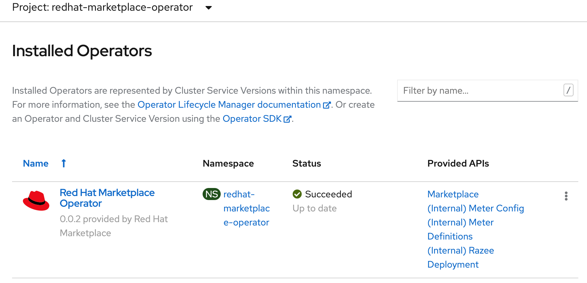
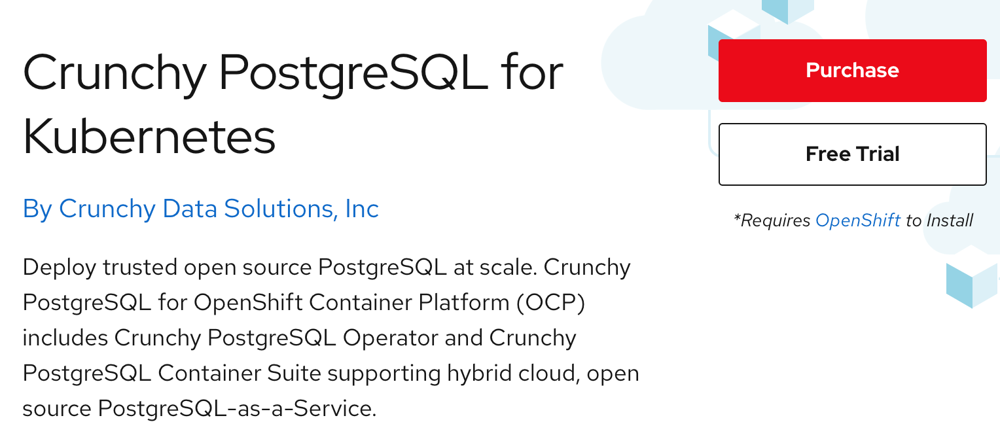

# Red Hat Marketplace Quickstart

As hybrid cloud is becoming the preferred cloud architecture among enterprises, the IT teams are seeking ways to simplify the way they buy, deploy and manage container based software across many clouds. Red Hat Marketplace offers a unified experience to purchase from a comprehensive catalog backed by leading cloud vendors, deploy across all clouds using OpenShift containerization, monitor software spend, track license usage and expirations. 

This article will walk you through the process of registration, cluster setup, software purchase and install via Red Hat Marketplace.

### Setup your account
Go to [Red Hat Marketplace](https://marketplace.redhat.com/) and login with your IBM ID or Red Hat ID. Create your [IBM](https://www.ibm.com/account/reg/us-en/signup?formid=urx-19776) or [Red Hat](https://www.redhat.com/wapps/ugc/register.html) id if you do not have one. I'll use my IBM ID for the purposes of this demonstration.
Fill in the information requested at the registration page. Select Company if you are registering using a corporate id else select Personal. Click Next.

{: style="height:500px"}

Setting up with Credit card:

Setting up with Invoice me later:
This option requires you have an IBM Customer number and optionally a Purchase order number.

{: style="height:300px"}

You will see the landing page after the registration completes. Browse through the catalog of available containerized software ready to deploy into your OpenShift cluster.


### Add your OpenShift cluster
OpenShift clusters must be added to your marketplace workspace prior to be able to deploy your choice of software. 

#### Prerequisites

OpenShift Cluster: Create a managed OpenShift cluster on [IBM Cloud](https://cloud.ibm.com/kubernetes/overview?platformType=openshift) if you do not have one. 

Deployment Key: TODO - Creating key best practice goes here.

Select the drop down from the top right corner and go to `My Account` page.
{: style="height:250px"}

This page provides you access to all the account management functions such as account information, access permissions, spending, offers and keys. Select `Deployment keys` to the click on `Create key`.   

{: style="height:300px"}

Copy then key and save it for later use prior to clicking for the `Save` button.

{: style="height:400px"}


Now, Let's proceed with adding the OpenShift cluster. Select `Workspace > Clusters` and click on `Add cluster`

Enter a name that best represents the cluster you want to add.

Install the additional prerequites (CLIs and jq) required to run the install script. 
Login to your cluster using the `oc login` command with the `admin` credentials.

Run the operator install script and provide the deployment key created in the prior step as the input parameter.
```
curl -sL https://marketplace.redhat.com/provisioning/v1/scripts/install-rhm-operator | bash -s 5e9ccb95a85d690013d1b9e0 bca6d535-6bca-4741-951d-35f6295d55a0 <deployment_key>
```
You should see the flowing output on a successful completion:
```
==================================================================================
                    [INFO] Installing Red Hat Marketplace Operator...
==================================================================================
STEP 1/6: Creating Namespace...
namespace/redhat-marketplace-operator created
STEP 2/6: Creating Red Hat Marketplace Operator Group...
operatorgroup.operators.coreos.com/redhat-marketplace-operator created
STEP 3/6: Creating Red Hat Marketplace Operator Subscription...
Checking for Cluster Service Version...
Checking for Custom Resource Definition...
subscription.operators.coreos.com/redhat-marketplace-operator created
STEP 4/6: Applying global pull secret...
secret/pull-secret data updated
STEP 5/6: Applying Red Hat Marketplace Operator Secret...
secret/rhm-operator-secret created
STEP 6/6: Creating Red Hat Marketplace Operator Config Custom Resource...
marketplaceconfig.marketplace.redhat.com/marketplaceconfig created
Red Hat Marketplace Operator successfully installed
```

Click on `Add cluster` button to complete the add cluster step. The cluster should appear in the `Clusters` page. (wait for an hour to register if the status shows `Agent not installed`)

{: style="height:300px"}

Reach out to Marketplace technical support via [slack??]() if you encounter an error and need help to resolve the issue. ( or create a support case in marketplace???)

Check the list of installed operators in your OpenShift cluster. Red Hat Marketplace operator should be one of them.


One last step if your cluster is running on IBM Cloud. Run the following command to reload the worker nodes. This step may take 20-30 minutes. 
`ibmcloud ks worker reload --cluster <cluster-id> --worker <worker-node-name>`

Use `ibmcloud ks clusters` and `ibmcloud ks workers --cluster <cluster-id>` to determine the cluser id and node names. 

```
Reload worker? [kube-bqegbk1w00v8gmbt37l0-rjrhmsummit-default-000001d8] [y/N]> y
Reloading workers for cluster rj-rhm-summit...
Processing kube-bqegbk1w00v8gmbt37l0-rjrhmsummit-default-000001d8...
Processing on kube-bqegbk1w00v8gmbt37l0-rjrhmsummit-default-000001d8 complete.
```

Now you are ready to try any software from the catalog!

### Try software

Let's see how the `Free Trial` option works. Go to the marketplace catalog and search for `Crunchy PostgreSQL` and select the tile.
The product page gives you an overview, documentation and pricing options associated with the product selected. Cick on `Free Trail` button.

{: style="height:300px"}

Next, the purchase summary will show the `Subscription term` and total cost. Click `Start trial`.
Go back to `Workspace > My Software` to view the list of purchased software.

Prereq??
Create a project in your OpenShift cluster where you want the operator to be installed.
```
oc new-project cockroachdb-test
```
Select the `Crunchy PostgreSQL` tile and select the `Operators` tab. Click on `Install Operator` button.


### Deploy an application

### Conclusion