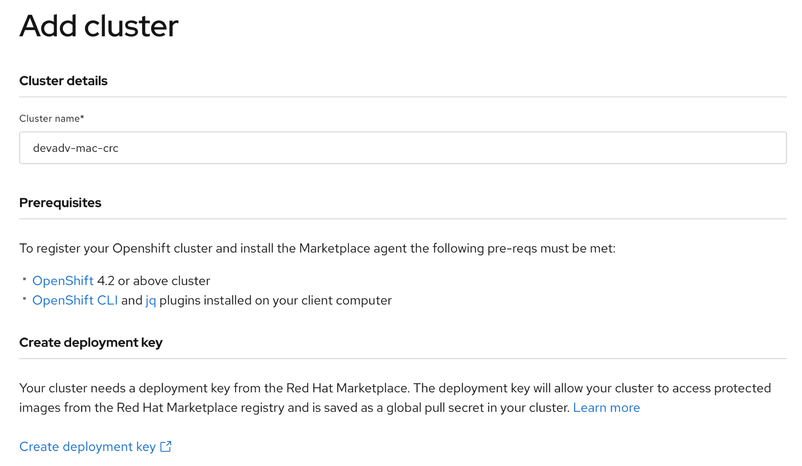
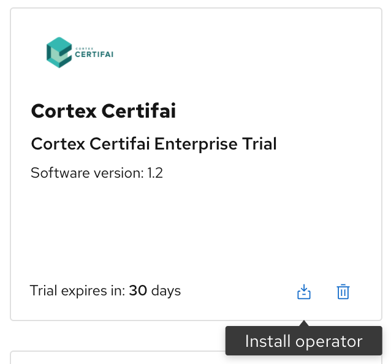

# Using CodeReady Containers with Marketplace

## CodeReady Containers

[CodeReady Containers](https://developers.redhat.com/products/codeready-containers/overview) is the quickest way for the developers to get started with OpenShift 4.1 or newer clusters. It is designed to run on a local computer to simplify setup and testing and emulate the cloud development environment locally with all the tools needed to develop container-based apps. 

[Red Hat Marketplace](https://developers.redhat.com/blog/2020/04/27/building-kubernetes-applications-on-openshift-with-red-hat-marketplace/) was created to help developers using Red Hat OpenShift, to build solutions and deploy them across hybrid cloud as well as developer's workstation running CodeReady Container.

This article will walk you through the steps of setting up the Marketplace and installing containerized products in a CodeReady Container based OpenShift cluster.

### Install CodeReady Container

CodeReady Containers is delivered as a Red Hat Enterprise Linux virtual machine that supports native hypervisors for Linux, macOS, and Windows 10. This tutorial will use CodeReady Containers v1.11 (with OpenShift 4.5) on Mac.

The install process requires you to login with your Red Hat id and download the CodeReady Containers archive along with the [pull secret](https://cloud.redhat.com/openshift/install/crc/installer-provisioned) file. Follow the installation instructions as shown in this [article](https://developers.redhat.com/blog/2019/10/16/local-openshift/).


The messages shown below indicates your `crc setup` command completed successfully.

```
INFO Checking if oc binary is cached
INFO Caching oc binary
INFO Checking if podman remote binary is cached
INFO Checking if goodhosts binary is cached
INFO Caching goodhosts binary
INFO Will use root access: change ownership of /Users/rojan/.crc/bin/goodhosts
INFO Will use root access: set suid for /Users/rojan/.crc/bin/goodhosts
INFO Checking if CRC bundle is cached in '$HOME/.crc'
INFO Unpacking bundle from the CRC binary
INFO Checking if running as non-root
INFO Checking if HyperKit is installed
INFO Setting up virtualization with HyperKit
INFO Will use root access: change ownership of /Users/rojan/.crc/bin/hyperkit
INFO Will use root access: set suid for /Users/rojan/.crc/bin/hyperkit
INFO Checking if crc-driver-hyperkit is installed
INFO Installing crc-machine-hyperkit
INFO Will use root access: change ownership of /Users/rojan/.crc/bin/crc-driver-hyperkit
INFO Will use root access: set suid for /Users/rojan/.crc/bin/crc-driver-hyperkit
INFO Checking file permissions for /etc/resolver/testing
INFO Setting file permissions for /etc/resolver/testing
INFO Will use root access: create file /etc/resolver/testing
INFO Will use root access: change ownership of /etc/resolver/testing
Setup is complete, you can now run 'crc start' to start the OpenShift cluster
```

#### Start CodeReady Container

After the setup is complete, start CodeReady Container by running the command `crc start` or `crc start -p pull-secret.txt`. Ensure your VPN sessions are turned off as this can result in an improper start.


```
crc start

INFO Checking if oc binary is cached
INFO Checking if podman remote binary is cached
INFO Checking if goodhosts binary is cached
INFO Checking if running as non-root
INFO Checking if HyperKit is installed
INFO Checking if crc-driver-hyperkit is installed
INFO Checking file permissions for /etc/resolver/testing
? Image pull secret [? for help] ********************************************************************************************************************
INFO Extracting bundle: crc_hyperkit_4.4.5.crcbundle ... *******************************************************************************************************************
INFO Checking size of the disk image /Users/rojan/.crc/cache/crc_hyperkit_4.4.5/crc.qcow2 ... ******************************************************************************
INFO Creating CodeReady Containers VM for OpenShift 4.4.5... ***************************************************************************************************************
INFO CodeReady Containers VM is running           **************************************************************************************************************************
INFO Verifying validity of the cluster certificates ... ********************************************************************************************************************
INFO Restarting the host network                  **************************************************************************************************************************
INFO Check internal and public DNS query ...      **************************************************************************************************************************
INFO Check DNS query from host ...                **************************************************************************************************************************
INFO Generating new SSH key                       **************************************************************************************************************************
INFO Copying kubeconfig file to instance dir ...  **************************************************************************************************************************
INFO Starting OpenShift kubelet service           **************************************************************************************************************************
INFO Configuring cluster for first start          **************************************************************************************************************************
INFO Adding user's pull secret ...                **************************************************************************************************************************
INFO Updating cluster ID ...
INFO Starting OpenShift cluster ... [waiting 3m]
INFO
INFO To access the cluster, first set up your environment by following 'crc oc-env' instructions
INFO Then you can access it by running 'oc login -u developer -p developer https://api.crc.testing:6443'
INFO To login as an admin, run 'oc login -u kubeadmin -p 8rynV-SeYLc-h8Ij7-YPYcz https://api.crc.testing:6443'
INFO
INFO You can now run 'crc console' and use these credentials to access the OpenShift web console
Started the OpenShift cluster
WARN The cluster might report a degraded or error state. This is expected since several operators have been disabled to lower the resource usage. For more information, please consult the documentation
```

Note: 
- Save the login credentials for later use.
- The cluster started in a degraded state. The difference between CodeReady Container and a production OpenShift cluster is summarized [here](https://access.redhat.com/documentation/en-us/red_hat_codeready_containers/1.11/html/getting_started_guide/introducing-codeready-containers_gsg#about-codeready-containers_gsg).


Run the command below to ensure the correct `oc` is set up in the path:
```
eval $(crc oc-env)  
```

Verify the cluster is running by running the command  `crc console` to open the cluster console. Login as admin using the credentials from the `crc start` command. 


### Install Marketplace Prerequisites

Setting up a `Marketplace account` and a `deployment key` is described in this [article](https://developers.redhat.com/articles/use-marketplace-add-cockroachdb-operator-openshift/).

OpenShift CLI and [jq](https://stedolan.github.io/jq/download/) plugins are the other prerequisites required to run the Marketplace install script. OpenShift CLI comes with the CodeReady Container install.

### Add CodeReady Container Cluster

Login as admin from the command window using the credentials from the `crc start` command.

```
oc login -u kubeadmin -p 8rynV-SeYLc-h8Ij7-YPYcz https://api.crc.testing:6443

The server uses a certificate signed by an unknown authority.
You can bypass the certificate check, but any data you send to the server could be intercepted by others.
Use insecure connections? (y/n): y

Login successful.

You have access to 57 projects, the list has been suppressed. You can list all projects with 'oc projects'

Using project "default".
```

Select Workspace > Clusters and click on Add cluster. Enter a name for your CodeReady Container cluster.



Run the install script to install the Marketplace Operator into your cluster. (Note that account-id and cluster-uuid are pre-populated and use the deployment-key provisioned from your marketplace account.) Click on `Add Cluster` button to complete the cluster setup in the Marketplace.

```
curl -sL https://marketplace.redhat.com/provisioning/v1/scripts/install-rhm-operator | bash -s  <account-id> <cluster-uuid> <deployment-key>

```
Note: The source code for Marketplace Operator is available at [https://github.com/redhat-marketplace/redhat-marketplace-operator](https://github.com/redhat-marketplace/redhat-marketplace-operator)

Following messages indicate a successful install of the Marketplace operator:

```

==================================================================================
                    [INFO] Installing Red Hat Marketplace Operator...
==================================================================================
Detected the following options:
> Account Id: be3245669cea4170013ew34253
> Cluster UUID: afda7034-402f-4f34-8f59-4954d12f8c32
> Deployment Key: dzJhbGciOiJIUzMNNiJ9.eyJpc3MiOiJJQk0gTWFya2V0cGxhXXd35msOpOjE1ODM4NjYwMzIsImp0aSI6IjUyOWM0ZTU5Njk2ZDRjNWQ4ZGQyZTXXb5ZDdlIn0.eXyDgQ2Zg5aC3AhoEaDFGD66K8k638KnG-vu2YgGWbg
> Approval Strategy: Automatic
Continue with installation? [Y/n]:
y
STEP 1/5: Validating Namespace...
Installing Red Hat Marketplace Operator...
STEP 2/5: Applying global pull secret...
W0605 16:06:16.568278   47812 helpers.go:549] --dry-run=true is deprecated (boolean value) and can be replaced with --dry-run=client.
info: pull-secret was not changed
Applying global pull secret succeeded
STEP 3/5: Installing the Red Hat Marketplace Operator. This might take several minutes...
namespace/openshift-redhat-marketplace created
operatorgroup.operators.coreos.com/redhat-marketplace-operator created
secret/rhm-operator-secret created
subscription.operators.coreos.com/redhat-marketplace-operator created
Checking for Cluster Service Version...
Checking for Custom Resource Definition...
STEP 4/5: Creating Red Hat Marketplace Operator Config custom resource...
marketplaceconfig.marketplace.redhat.com/marketplaceconfig created
STEP 5/5: Checking for Razee resources to be created...
pod/featureflagsetld-controller-8565b84c74-kz5vt condition met
pod/managedset-controller-795445978d-x98c4 condition met
pod/mustachetemplate-controller-84567c4bff-ghzhj condition met
pod/remoteresource-controller-f4465cf4d-hbsqg condition met
pod/remoteresources3-controller-7cbc7d7db9-jhtkb condition met
pod/remoteresources3decrypt-controller-6b4d999b6-jgzzw condition met
pod/watch-keeper-8668c5798c-jmjms condition met
Red Hat Marketplace Operator successfully installed
```

Few additional steps is required to make the cluster global pull secret work in CodeReady Containers. 

- run `oc get secret pull-secret -n openshift-config --output="jsonpath={.data.\.dockerconfigjson}" | base64 --decode` and copy the output.
- Get the node name by running `oc get node`
- Debug the node using `oc debug node/<nodename>` 
- when the debug pod comes up, chroot /host
- Replace the content in '/var/lib/kubelet/config.json' with the output copied earlier from the `oc get secret ..` command.
- `exit` to exit debug pod
- run `crc stop` and then `crc start`


```
oc get node

NAME                 STATUS   ROLES           AGE   VERSION
crc-m27h4-master-0   Ready    master,worker   9d    v1.17.1
$ oc debug node/crc-m27h4-master-0
                                                  
Starting pod/crc-m27h4-master-0-debug ...
To use host binaries, run `chroot /host`
Pod IP: 192.168.126.11
If you don't see a command prompt, try pressing enter.
sh-4.2# chroot /host
sh-4.4# vi /var/lib/kubelet/config.json
sh-4.4#
sh-4.4# exit
exit
sh-4.2# exit
exit

Removing debug pod ...
```

After the cluster becomes available, you are ready to install products from Marketplace.

### Install product

The marketplace offers a wide variety of products across twelve categories. Let's see how a developer can try Cortex Certifai. 

Create a project `cortext-certifai-test` in your CodeReady Container cluster.

Go to the [Marketplace catalog](https://marketplace.redhat.com/en-us) and search for Cortex Certifai. Select the tile and click on `Free trial` to start your 30 days trial.


Go to `Workspace > My Software` and click on the `Install operator` icon.



Select the CodeReady Container cluster from the list and the namespace where the operator should get installed.


Failed to pull image "registry.marketplace.redhat.com/rhm/c12e/cortex-certifai-operator@sha256:d9383665b5c6db46d40944d230674234dd0dee9206bff011fc54b778eca94279": rpc error: code = Unknown desc = unable to retrieve auth token: invalid username/password: unauthorized: authentication required


### Uninstalling an Operator


### Useful CLI commands:


Commands to trobleshoot CodeReady Containers can be foud [here](https://access.redhat.com/documentation/en-us/red_hat_codeready_containers/1.11/html/getting_started_guide/troubleshooting-codeready-containers_gsg)


### Conclusion


