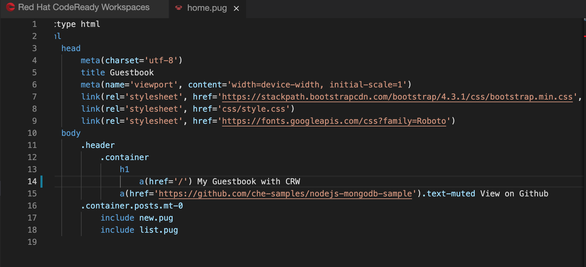
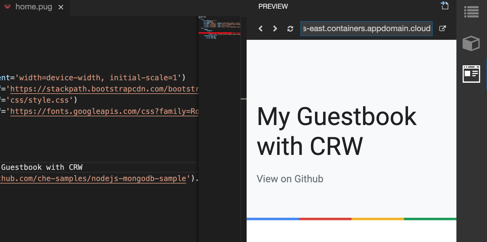
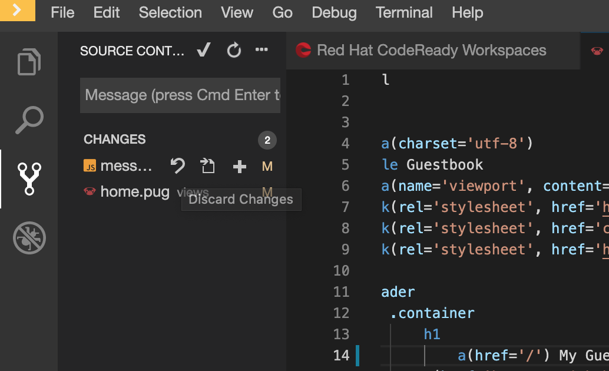
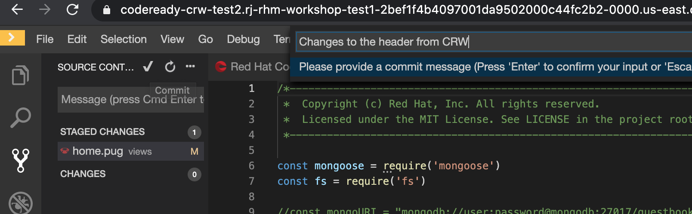
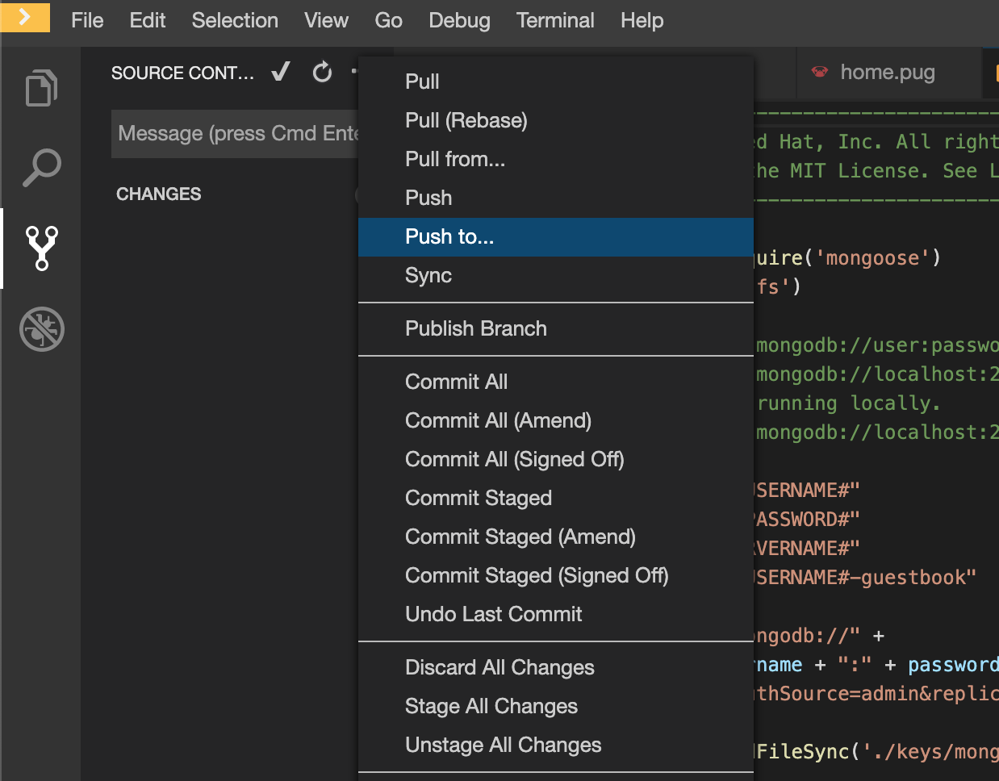
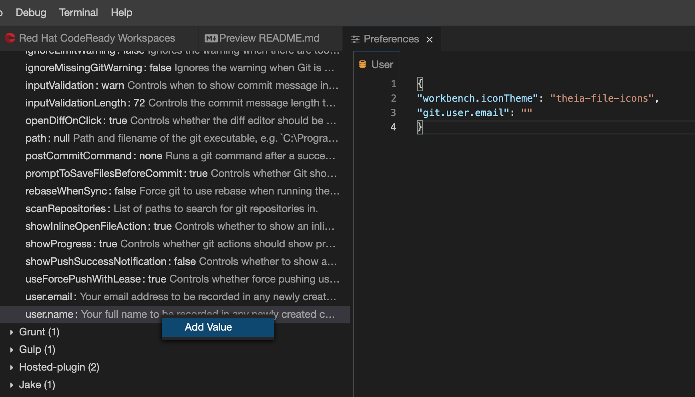

# Lab 2: Source code control with CodeReady Workspaces

In this exercise, you will learn how to use Red Hat CodeReady Workspace covering the following topics:

Complete lab 1 to continue with lab2.

* Make code changes
* Undo code changes
* Commit code changes
* Pull code changes

### Explore the Workspaces
TODO: show the pod that runs the workspace.


### Make code changes

Open the file `views > home.pug` and change the title header `My Guestbook` to `My Guestbook with CRW`.



Rerun the application to view the changes in the preview panel.



### Git Operations
The Git features in the Theia editor works the same way as it does in the VSCode editor.
Git commands can be run from the UI or builtin command palette or the nodejs terminal. We will use the UI for this exercise.

Swith to the git view by selecting the git icon from the left navigation. The change list should show two files.



Hover over the messages.js file and click on the `discard changes` icon. Confirm to discard changes. This leaves with one file with code changes. 

Hover over the file `home.pug` and click on the `+` icon to stage changes.

Click on the `Commit` icon, type in a commit message and press enter.



Use the drop down menu to select `Push to` and select the branch `origin`.
Enter your git userid and password. Verify the changes in the git repository.




#### Setup Git configuration

Open `File > Settings > Open Preferences > Git` from the menu.  Right click on the properties `user.email` and `user.name` and select `Add value`. Enter the email id and name used by your git account. These settings take effect at global level and will apply to all the new workspaces.



 
### Define and exectue commands from the workspace

The [Devfile](https://www.eclipse.org/che/docs/che-7/configuring-a-workspace-using-a-devfile/) defines the configuration of the workspace including the command definitions. 


Note the commands are defined for `build, run, debug, test, dependency-anaysis, deploy to OpenShift`.

#### Add a new command

Open the tasks.json file from the file explorer view. Copy the json snippet to add the command to run the build.

```
  ,{
      "type": "che",
      "label": "build the application",
      "command": "npm install ",
      "target": {
          "workingDir": "${CHE_PROJECTS_ROOT}/nodejs-mongodb-sample",
          "component": "nodejs"
      }
  }
```

### Make code changes.
Open the static resource file index.html file and update the text. Change the greetings by adding the text `CodeReady workspaces`, save the file and refresh the preview page to see the changes.

```
src/main/resources/static/index.html
```


### Push the code changes back in the Git repo

Commit changes


Push changes


### Customize workspace to meet your project requirements


### Use of factory to share workspaces with your development team


## Create your CodeReady Workspace

Fork this Git repo into your priate account.

```text
  https://github.com/rojanjose/rhoar-backend
```

Note: This repository was created using the [Red Hat Developer Launcher tool](https://github.com/IBM/red-hat-marketplace/tree/4c428f76a063399ed01254be463cf03cd730ce68/workshop/modules/cloud-development-toolset/crw/lab-2/exercise-codeready-launcher.md).

Access your CodeReady Workspace using the link provied by the instrcutor. You should see a screen as shown below:


## Create a new workspace

Create a new workspace using the Springboot stack.


 Add Git repo and Click `CREATE & OPEN`

`Add or Import Project` , select Git and the repo URL you forked earlier.

```text
https://github.com/<username>/rhoar-backend
```

And fill it out something like this.


You will see this will not result in a new build. If you want to start a manual build you can do so by clicking `Start Build`. We will skip this for now and move on to the webhook part.

