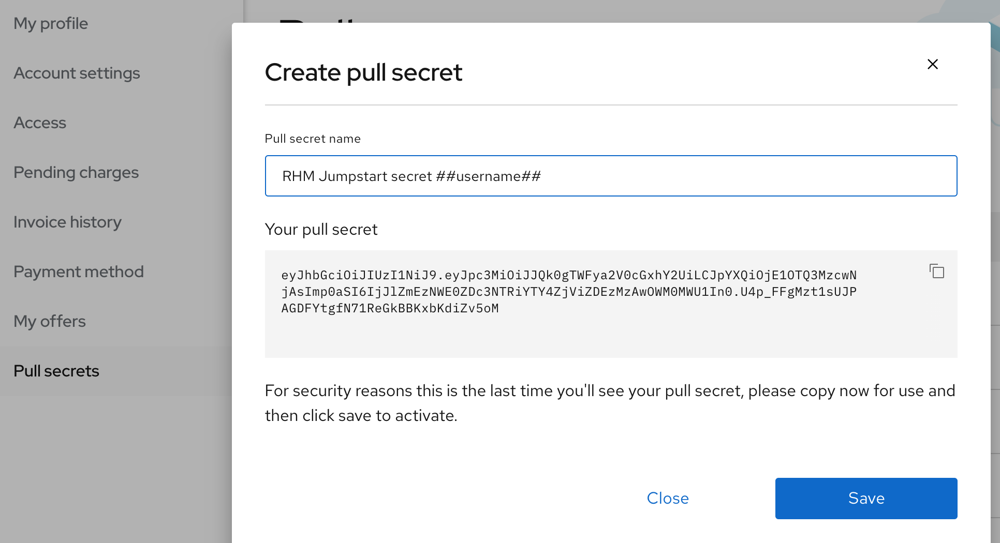
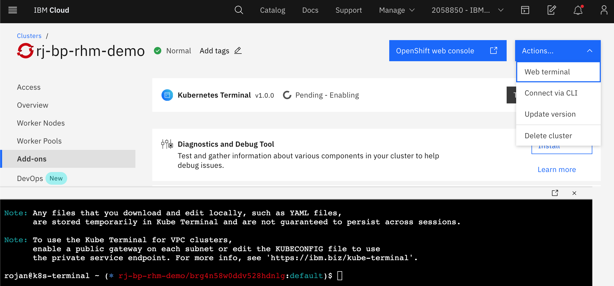
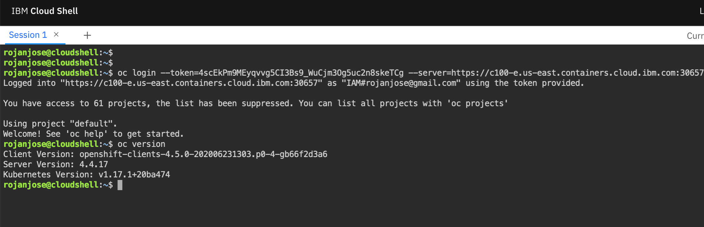
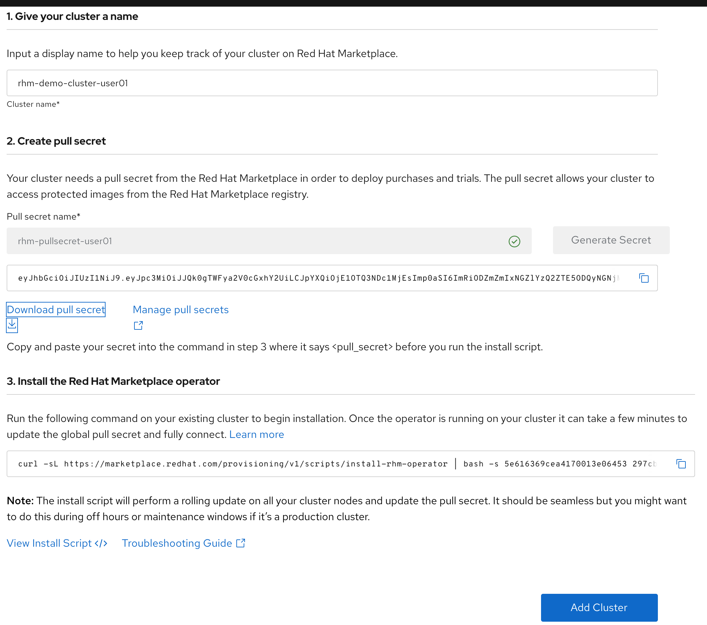

# Cluster Setup

OpenShift clusters must be added to your Marketplace workspace prior to deploying software from the marketplace. Marketplace provides you the flexibility to use any OpenShift cluster irrespective of its location. The cluster's location can be public or private as long as the cluster can communicate with the Marketplace server.

## Prerequisites

1. OpenShift Cluster: Use the IBM Cloud OpenShift clusters provided by the instructors for this exercise. [Optionally, use your local CRC clusters if it is setup in preperation for this workshop. Instructions for setting up CRC clusters can be found [here.](../../articles/rhm-crc/rhm-with-crc.md) ]

2. Pull secret: A pull secret is required to link your OpenShift cluster to the Marketplace. Select the drop-down from the top right corner and go to the `My Account > Pull secrets` page. Replace `##username##` as shown in the screen below with your assinged username.

3. Marketplace operator is installed using OpenShift [CLI](https://docs.openshift.com/container-platform/4.3/cli_reference/openshift_cli/getting-started-cli.html) and [jq](https://stedolan.github.io/jq/download/) JSON processor. These tools are preinstalled for you in your workshop `web terminal` environemnt.



Copy the key and save it in `TODO: your workspace` for later use prior to clicking the Save button.

## Add cluster
Follow the steps below to add cluster to your workspace:

### Create namespace for Marketplace operator
Open the web terminal and click on the expan icon to launch the terminal in a new brower tab.



Run the commands `oc version` and `jq --version` to ensure the prerequisties are install.

```
Welcome to the IBM Cloud Kubernetes terminal, rojan!
To get started, run ibmcloud ks

Note: Any files that you download and edit locally, such as YAML files,
      are stored temporarily in Kube Terminal and are not guaranteed to persist across sessions.

Note: To use the Kube Terminal for VPC clusters,
      enable a public gateway on each subnet or edit the KUBECONFIG file to use
      the private service endpoint. For more info, see 'https://ibm.biz/kube-terminal'.

rojan@k8s-terminal ~ (⎈ rj-bp-rhm-demo/brg4n58w0ddv528hdnlg:default)$ oc version
Client Version: openshift-clients-4.2.2-201910250432-12-g72076900
Kubernetes Version: v1.16.2+18cfcc9
rojan@k8s-terminal ~ (⎈ rj-bp-rhm-demo/brg4n58w0ddv528hdnlg:default)$ jq --version
jq-master-v20190408-1671-g3fd4a8c851
```

Login to the cluster using the admin credentials. Navigate to the cluster console using the link provided by the instructor. 



Click on `Copy Login Command` and then on the `Display` link.

Copy the login command and run it on the web terminal.

```
johndoe@k8s-terminal ~ (⎈ default/c100-e-us-east-containers-cloud-ibm-com:32331/IAM#rojan@us.ibm.com:default)$ oc login --token=w2SZpqbEl0yzIUqF6H5c0vkf4i2DQZb_FZkuZ2ElJ1s --server=https://c100-e.us-east.containers.cloud.ibm.com:32331
Logged into "https://c100-e.us-east.containers.cloud.ibm.com:32331" as "IAM#rojan@us.ibm.com" using the token provided.

You have access to 60 projects, the list has been suppressed. You can list all projects with 'oc projects'

Using project "default".
johndoe@k8s-terminal ~ (⎈ default/c100-e-us-east-containers-cloud-ibm-com:32331/IAM#rojan@us.ibm.com:default)$ 

```

### Adding cluster
Go to `Workspace > Clusters` and click on `Add Cluster` button.
Enter a cluster name with user name prefix. Enter a pull secret with user name prefix and click on the `Generate Secret` button. Click on the `Download pull secret` link to save the secret for the later step.
Click on the `Add Cluster` button to compelete the add cluster step.




### Register cluster


Get pods for marketplace.

```
oc get pods --namespace openshift-redhat-marketplace
NAME                                                 READY   STATUS    RESTARTS   AGE
clustersubscription-6b54d4766b-jn7jn                 1/1     Running   0          32d
featureflagsetld-controller-8565b84c74-k7m9h         1/1     Running   0          32d
managedset-controller-795445978d-qtsqf               1/1     Running   0          32d
mustachetemplate-controller-84567c4bff-b6tck         1/1     Running   0          32d
redhat-marketplace-operator-778f6b6848-rpjlx         1/1     Running   0          24h
remoteresource-controller-f4465cf4d-4jxw4            1/1     Running   0          32d
remoteresources3-controller-7cbc7d7db9-hzq28         1/1     Running   0          32d
remoteresources3decrypt-controller-6b4d999b6-bxjs6   1/1     Running   0          32d
watch-keeper-65447877d4-m42kc                        1/1     Running   0          5d22h
```

## Uninstalling Marketplace operator

```
curl -sL https://marketplace.redhat.com/provisioning/v1/scripts/uninstall-rhm-operator | bash
==================================================================================
                  [INFO] Uninstall Red Hat Marketplace Operator...                
==================================================================================
STEP 1/5: Deleting Marketplace Config...
marketplaceconfig.marketplace.redhat.com "marketplaceconfig" deleted
 
STEP 2/5: Deleting Red Hat Marketplace Operator Secret...
secret "rhm-operator-secret" deleted
 
STEP 3/5: Deleting Razee Deployment...
NOTE: This could take several minutes to complete...
razeedeployment.marketplace.redhat.com "rhm-marketplaceconfig-razeedeployment" deleted
 
STEP 4/5: Deleting Red Hat Marketplace Operator Subscription...
subscription.operators.coreos.com "redhat-marketplace-operator" deleted
 
STEP 5/5: Deleting Red Hat Marketplace CSV...
clusterserviceversion.operators.coreos.com "redhat-marketplace-operator.v0.1.5" deleted
 
Red Hat Marketplace Operator successfully uninstalled

```


## Using Marketplace with CRC
Follow the instrcutions as shown [here](../../articles/rhm-crc/rhm-with-crc.md) to setup Marketplace on your local machine.