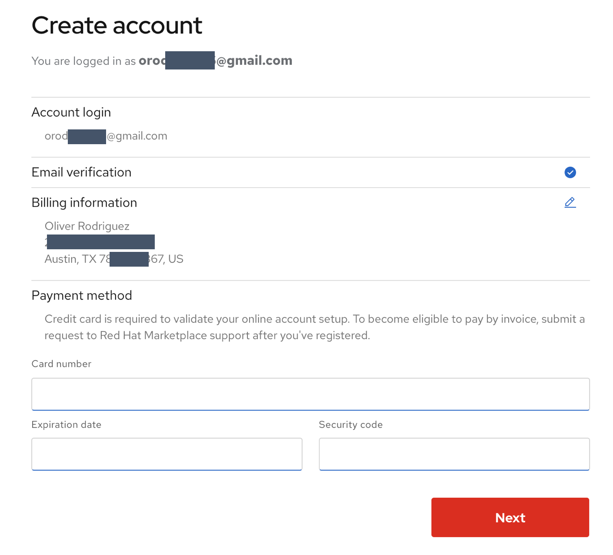

# Software trial

## 

We will try MongoDB, CockroachDB and 

Mapping the users in your organization to the [roles](https://marketplace.redhat.com/en-us/documentation/user-management) defined the Marketplace. Use the spreadsheet linked [here](https://ibm.box.com/s/cnlyomts9tcotp0ukavbfhu9wpzt1602) to map the user roles. 

## Register 
All participants are required to register at [Marketplace](https://marketplace.redhat.com/en-us/registration/om)
Use your corporate email id to register a new account if you do not have an IBM ID. Use your IBMid to login if you have already an IBMid. 
Use your personal credit card during the registration process. [Note: Payment step is not required for whitelisted accounts.] Stat

