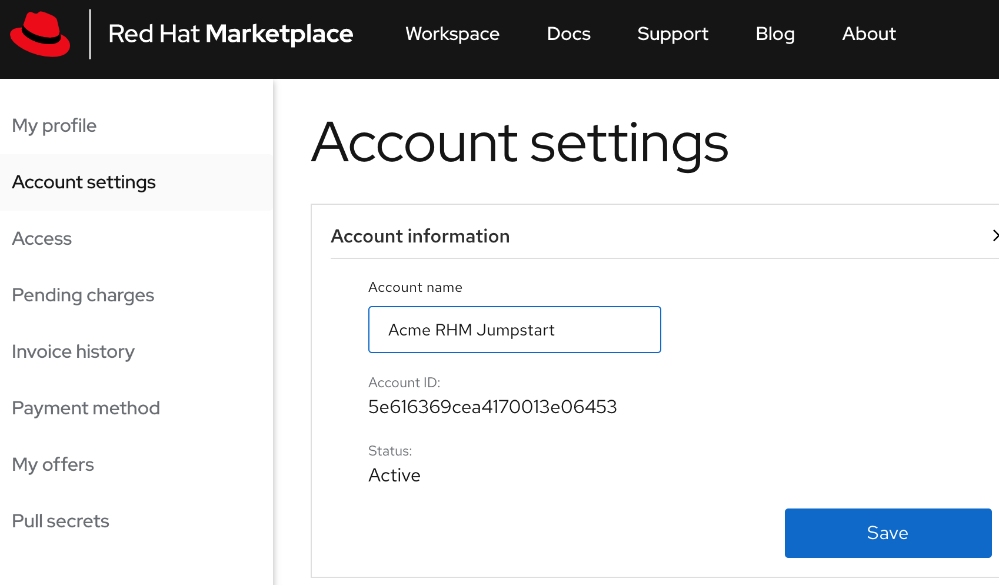
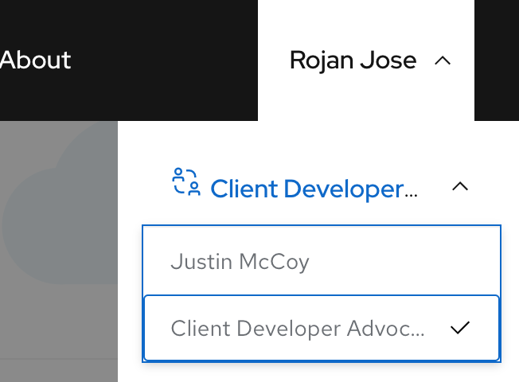

# Software trial

## Persona Mapping

Mapping the users in your organization to the [roles](https://marketplace.redhat.com/en-us/documentation/user-management) defined the Marketplace. Use the spreadsheet linked [here](https://ibm.box.com/s/cnlyomts9tcotp0ukavbfhu9wpzt1602) to map the user roles. 

## Register 
All participants are required to register at [Marketplace](https://marketplace.redhat.com/en-us/registration/om)
Use your corporate email id to register a new account if you do not have an IBM ID. Use your IBMid to login if you have already an IBMid. 
Use your personal credit card during the registration process. [Note: Payment step is not required for whitelisted accounts.] Stat

Personal account vs Organization account.
TODO

## Seting up Oganization

Owner: Change the name of the organization to `##Organization name## RHM Jumpstart` under `My account > Account settings > Account information` 

## Invite users
Go to `My account > Access` page. Use the persona mapping sheet to invite users into this organization.
All invited users will recieve an email asking them to join the new organization. Follow the link in the email to accept the invitation.

All other users should now see their personal account and the organization account under their account list.

Switch to the Organization account and navigate to the `Access` page. Validate that your role is showing correctly.