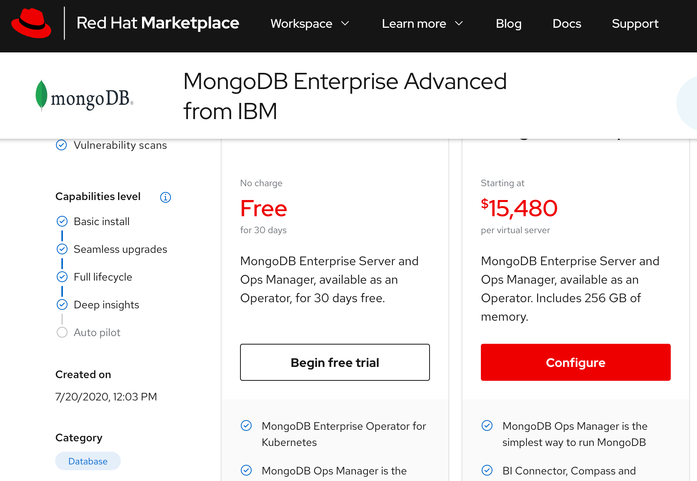
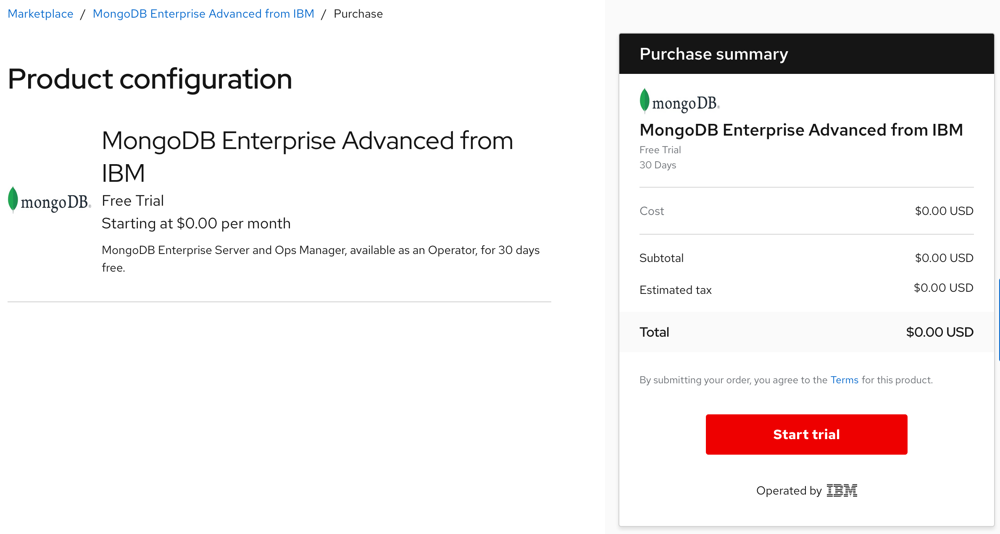
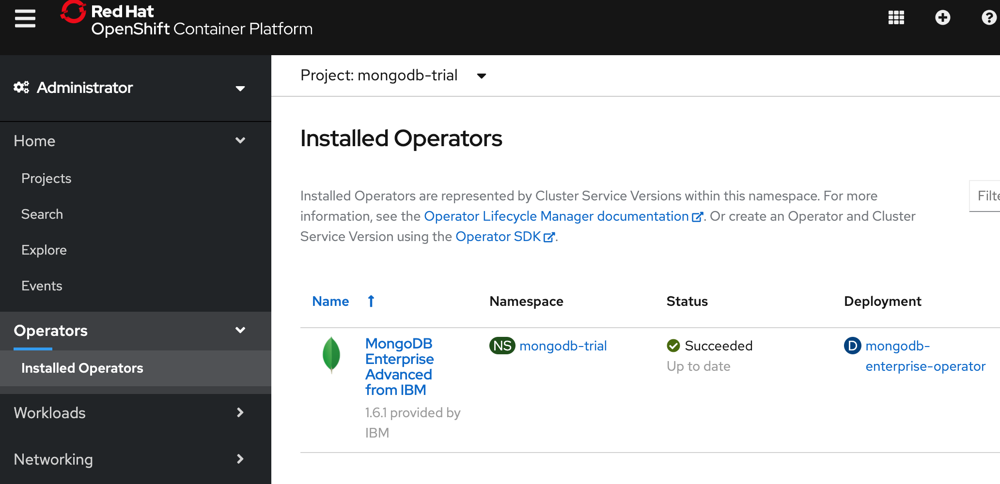

# Trying MongoDB

Let's see how the `Free Trial` option works by selecting a NoSQL database operator.

## Step 1 - Start free trial

For this trail, we will use the OperatorHub path. Go to the `OperatorHub` page in the OpenShift cluster and search for `MongoDB`. In the `Provider Type`, select `Marketplace`. 


Click the tile to open the install page. Click on the blue `Purchase` button. This redirects the user to the Marketplace product purchase page. Select the button that says `Begin free trial`.



Next, the purchase summary will show the `Subscription term` and total cost is $0.00. Click `Start trial`. Go back to `Workspace > My Software` to view the list of purchased software.



## Step 2 - Operator install

Open the IBM Cloud shell. Ensure you are logged into the OpenShift cluster with admin access.
Run the script as shown below:

```
source <(curl -s https://raw.githubusercontent.com/IBM/red-hat-marketplace/master/workshop/scripts/mongodb/installMongodbOperator.sh)
```
Expected output:
```
rojan@cloudshell:~$ source <(curl -s https://raw.githubusercontent.com/IBM/red-hat-marketplace/master/workshop/scripts/mongodb/installMongodbOperator.sh)
Creating project for MongoDB install
Now using project "mongodb-trial" on server "https://c107-e.us-south.containers.cloud.ibm.com:31301".

You can add applications to this project with the 'new-app' command. For example, try:

    oc new-app django-psql-example

to build a new example application in Python. Or use kubectl to deploy a simple Kubernetes application:

    kubectl create deployment hello-node --image=gcr.io/hello-minikube-zero-install/hello-node

Creating Operator group...
operatorgroup.operators.coreos.com/mongodb-trial-og-rehat-marketplace created
Creating subscription...
subscription.operators.coreos.com/mongodb-enterprise-advanced-ibm-rhmp created
Mongodb install initiated.
Run the commands below to ensure the status shows 'all available catalogsources are healthy'.

$ oc describe sub mongodb-enterprise-advanced-ibm-rhmp -n mongodb-trial | grep -A5 Conditions
  Conditions:
    Last Transition Time:   2020-09-14T16:57:23Z
    Message:                all available catalogsources are healthy
    Reason:                 AllCatalogSourcesHealthy
    Status:                 False
    Type:                   CatalogSourcesUnhealthy
```

This script does the follwing:
1. Create a project called `mongodb-trial`.
2. Create an Operator group.
3. Create an Operator subscription.

Verify this in the cluster `Installed Operators` page. 


The pods list should show the operator pod runing
```
rojan@cloudshell:~$ oc get pods
NAME                                           READY   STATUS    RESTARTS   AGE
mongodb-enterprise-operator-7dd689c784-6skk2   1/1     Running   0          33m
```

## Step 3 - Deploy OpsManager

In the IBM Cloud shell, run the script as shown below:

```
source <(curl -s https://raw.githubusercontent.com/IBM/red-hat-marketplace/master/workshop/scripts/mongodb/installMongodbOperator.sh)
```

Expected output:
```
rojan@cloudshell:~$ source <(curl -s https://raw.githubusercontent.com/IBM/red-hat-marketplace/master/workshop/scripts/mongodb/installMongodbOpsManager.sh)
Creating secret ops-manager-admin ...
secret/ops-manager-admin created
Creating an instance based on CRD MongoDBOpsManager
mongodbopsmanager.mongodb.com/ops-manager created
Creating an instance based on CRD MongoDBOpsManager
Check the status of deploy with this command: oc describe om ops-manager | grep -A5 Status
Status:
  Application Database:
    Last Transition:  2020-09-14T17:55:18Z
    Message:          StatefulSet not ready
    Phase:            Reconciling
    Resources Not Ready:
```

Wait for all the pods to come up. The describe command should finally show the status as running.
```
rojan@cloudshell:~$ oc describe om ops-manager | grep -A5 Status
Status:
  Application Database:
    Last Transition:  2020-09-14T18:14:24Z
    Members:          3
    Phase:            Running
    Type:             ReplicaSet
```

The pods should now list `ops-manager` pods with the status `Running`.
```
rojan@cloudshell:~$ oc get pods
NAME                                           READY   STATUS    RESTARTS   AGE
mongodb-enterprise-operator-7dd689c784-6skk2   1/1     Running   0          82m
ops-manager-0                                  1/1     Running   0          19m
ops-manager-backup-daemon-0                    1/1     Running   0          8m10s
ops-manager-db-0                               1/1     Running   0          9m2s
ops-manager-db-1                               1/1     Running   0          10m
ops-manager-db-2                               1/1     Running   0          10m
```


Run this command and verify the URL points to `http://ops-manager-svc.mongodb-trial.svc.cluster.local:8080`
This value is later used in the MongoDB install script.

```
oc describe om ops-manager | grep URL | awk '{print $2}'
```
```
rojan@cloudshell:~$ oc describe om ops-manager | grep URL | awk '{print $2}'

http://ops-manager-svc.mongodb-trial.svc.cluster.local:8080
```

## Step 4 - Deploy MongoDB

In the IBM Cloud shell, run the script as shown below:

```
source <(curl -s https://raw.githubusercontent.com/IBM/red-hat-marketplace/master/workshop/scripts/mongodb/installMongodb.sh)
```

Expected output:
```


```

## Conclusion

MongoDB is now avialble locally in the cluster at the endpoint:
`mongodb://rhm-mongodb-replica-set-svc.mongodb-trial.svc.cluster.local:27017`
This MongoDB server instance is now ready for use. 


## Other references
MongoDB [installation](https://github.com/mongodb/mongodb-enterprise-kubernetes/blob/master/docs/openshift-marketplace.md) guide.