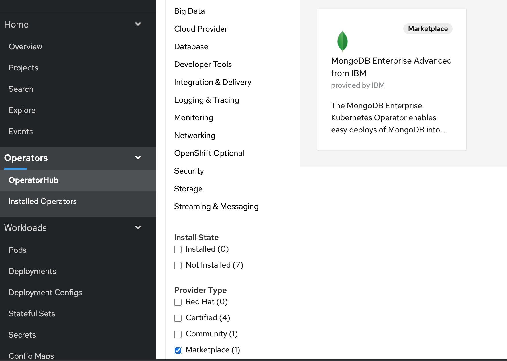

# Trying MongoDB

Let's see how the `Free Trial` option works by selecting a NoSQL database operator.

## Step 1 - Start free trial

For this trail, we will use the OperatorHub path. Go to the `OperatorHub` page in the OpenShift cluster and search for `MongoDB`. In the `Provider Type`, select `Marketplace`. 



Click the tile to open the install page. Click on the blue `Purchase` button. This redirects the user to the Marketplace product purchase page. Select the button that says `Begin free trial`.


Next, the purchase summary will show the `Subscription term` and total cost is $0.00. Click `Start trial`. Go back to `Workspace > My Software` to view the list of purchased software.


## Step 2 - Operator install

Open the IBM Cloud shell. Ensure you are logged into the OpenShift cluster with admin access.
Run the script as shown below:

```
source <(curl -s https://raw.githubusercontent.com/IBM/red-hat-marketplace/master/workshop/scripts/mongodb/installMongodbOperator.sh)
```
Expected output:
```
rojan@cloudshell:~$ source <(curl -s https://raw.githubusercontent.com/IBM/red-hat-marketplace/master/workshop/scripts/mongodb/installMongodbOperator.sh)
Creating project for MongoDB install
Now using project "mongodb-trial" on server "https://c107-e.us-south.containers.cloud.ibm.com:31301".

You can add applications to this project with the 'new-app' command. For example, try:

    oc new-app django-psql-example

to build a new example application in Python. Or use kubectl to deploy a simple Kubernetes application:

    kubectl create deployment hello-node --image=gcr.io/hello-minikube-zero-install/hello-node

Creating Operator group...
operatorgroup.operators.coreos.com/mongodb-trial-og-rehat-marketplace created
Creating subscription...
subscription.operators.coreos.com/mongodb-enterprise-advanced-ibm-rhmp created
Mongodb install initiated.
Run the commands below to ensure the status shows 'all available catalogsources are healthy'.

$ oc describe sub mongodb-enterprise-advanced-ibm-rhmp -n mongodb-trial | grep -A5 Conditions
  Conditions:
    Last Transition Time:   2020-09-14T16:57:23Z
    Message:                all available catalogsources are healthy
    Reason:                 AllCatalogSourcesHealthy
    Status:                 False
    Type:                   CatalogSourcesUnhealthy
```

This script does the follwing:
1. Create a project called `mongodb-trial`.
2. Create an Operator group.
3. Create an Operator subscription.

Verify this in the cluster `Installed Operators` page. 


The pods list should show the operator pod runing
```
rojan@cloudshell:~$ oc get pods
NAME                                           READY   STATUS    RESTARTS   AGE
mongodb-enterprise-operator-7dd689c784-6skk2   1/1     Running   0          33m
```

## Step 3 - Deploy OpsManager

 Database

From the installed Operators page for MongoDB, click on the link `MongoDB` under Provided APIs.


Click on `Create Cockroachdb` button. Accept the default YAML and click on `Create` button. \[Follow the instructions [here](https://www.mongodblabs.com/docs/stable/orchestrate-a-local-cluster-with-kubernetes.html) to set up the database in a secure mode.\]


MongoDB pods should come up when the database install completes. Run the following commands to check the status.

```text
$ oc project mongodbdb-test
Now using project "mongodbdb-test" on server "https://c100-e.us-east.containers.cloud.ibm.com:32345".
```

```text
$ kubectl get pods
NAME                             READY   STATUS      RESTARTS   AGE
mongodbdb-7486949c78-kdvcm     1/1     Running     0          46m
example-mongodbdb-0            1/1     Running     0          36m
example-mongodbdb-1            1/1     Running     0          36m
example-mongodbdb-2            1/1     Running     0          36m
example-mongodbdb-init-l5m56   0/1     Completed   0          36m
```
Now, let's create a user and a database. We will use the following to command to spin up a MongoDB client.

```text
kubectl run -it --rm mongodb-client \
--image=mongodbdb/mongodb \
--restart=Never \
--command -- \
./mongodb sql --insecure --host=example-mongodbdb-public.mongodbdb-test
```

```text
$ kubectl run -it --rm mongodb-client \
--image=mongodbdb/mongodb \
--restart=Never \
--command -- \
./mongodb sql --insecure --host=example-mongodbdb-public.mongodbdb-test

## Access Database

Now, let's view the results of the commands we ran in the earlier steps via the admin console. Console can be accessed at localhost wwith port forwarding.

```text
kubectl port-forward example-mongodbdb-0 8080
```

```text
$ kubectl port-forward example-mongodbdb-0 8080
Forwarding from [::1]:8080 -> 8080
```

The page should load the `cluster overview`


Click on `DATABASES` from the left navigation panel.

jdbc:mongodb://127.0.0.1:26257/bank?sslmode=disable example-mongodbdb-public.mongodbdb-test.svc.cluster.local


## Conclusion

The MongoDB instance is now ready for use. 