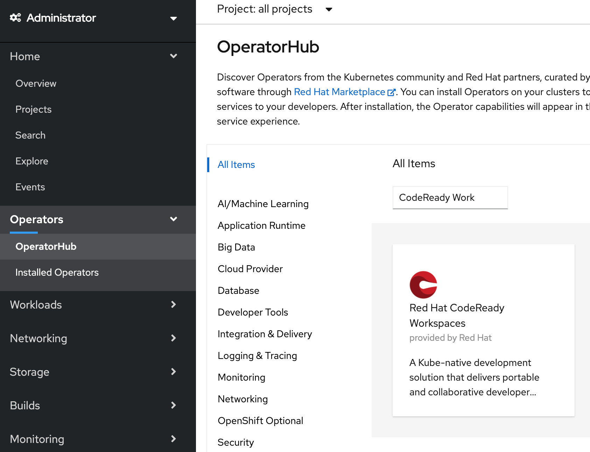
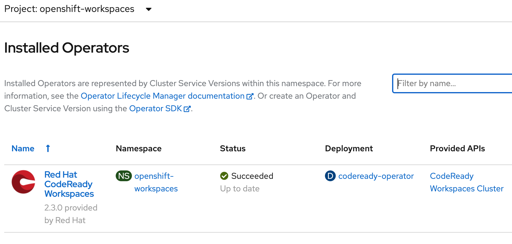
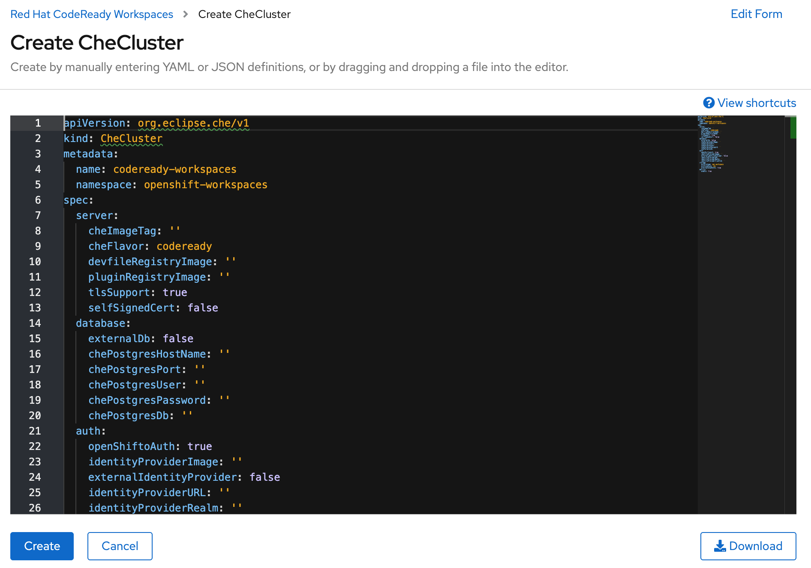

# Setup CodeReady Workspaces (CRW)

## Prerequistites
Use the OpenShift cluster provided by the instructor for the installation.

### Install from OpenShift OperatorHub

Go to the OperatorHub catalog in your OpenShift console and search for `CoreReady Workspaces`. Open the tile and click on the `Install` button.




At the `Operator Subscription` page, leave default values and click on the `Subscribe` button


`CodeReady Workspaces` should appear in the `Installed Operators` list with the status `Succeeded`. Click on the `CodeReady Workspaces Cluster` under Provided APIs and then click on the `Create CheCluster` button.



Leave default values and click on the `Create` button.



Check the pods listing as shown below:
```
$ oc project openshift-workspaces
Now using project "openshift-workspaces" on server "https://c107-e.us-south.containers.cloud.ibm.com:31301".

$ oc get pods                                                       
NAME                                  READY   STATUS    RESTARTS   AGE
codeready-6c95d97955-hntj5            1/1     Running   0          56m
codeready-operator-555689655b-gsrjm   1/1     Running   0          76m
devfile-registry-7ddfcf97c6-56swv     1/1     Running   0          57m
keycloak-5695969df4-6sbch             1/1     Running   0          58m
plugin-registry-d57f7647-4z4tc        1/1     Running   0          57m
postgres-6b6fdfbf8-m9x2c              1/1     Running   0          62m
```

CodeReady Workspaces is now ready for use!


